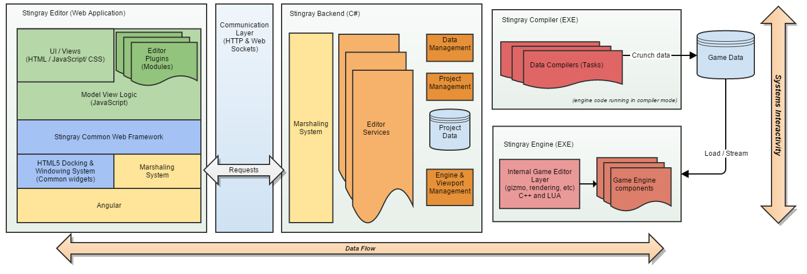
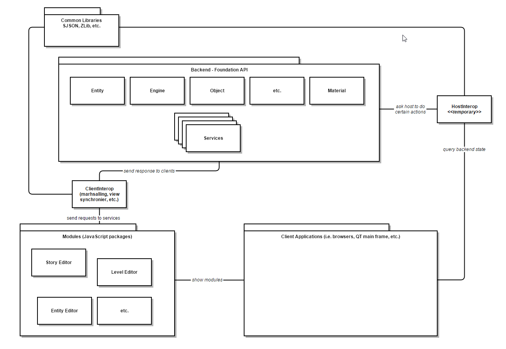
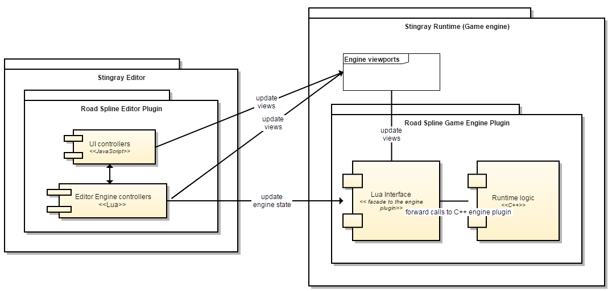

# Objectives

- Generic data model that describes all engine and user defined types.
- Create and edit entities and components to extends the engine and your game.
- Only use SJSON, JavaScript and Lua to extend the editor.
	- C# and C++ is still needed for internal development of the editor.
- Simplify backend code base

# Architecture




The tools foundation is divided in three main layers. At the center of everything you have the backend which is responsible for the data management and to expose all the services that operates on the data. Then you have the front-end layer which are extensions on top of the backend to offer editing workflows and various tools for game authoring purposes. You also have the engine layer that the backend uses to present the viewport that allow 3D editing of assets and the data compiler that compiles the various assets that are edited in the editor. On the front-end you also have the host which is the component that assemble and display the various editors (i.e. CEF, Chrome, etc.).

# Layers

## Engine (C++ and Lua)

The editor host many engines to allow game authoring. The editor starts an editor engine process to create 3D viewports that display level entities, previews, resources editor viewers, etc. The editor also manages a test engines to run level in a test environment and to run projects. Finally the editor host the data compiler to send request in order to compiled edited resources.

## Backend

1. Data management

	The data driven layer is responsible to handle engine and user defined data. At the root of everything we have the data model layer which is responsible to manage all resources of a project. In the data model layer you have:

    - **Data descriptors**: These are SJSON files that describe all engine and user defined types. A data descriptor defines all the fields of a data and the constraints on them. It also describes all the editor meta information to properly populate the various editors with the right information and controls.
    	- SJSON files
    	- Describes all the fields of types
    	- Describes all the relationships with other types
    	- Describes all the constraints
    	- Describes all the editor meta-data to generate UI
    - **Data manipulators**: The manipulators are the accessors that reads and writes the data for a given descriptor. For example the manipulators are responsible to enforce the constraints of the descriptor for given fields. They are also responsible to trigger the right notifications for any listeners to react of data changes.
    	- Generic getters and setters
        - Data parsers
    - **Data service**: The data service is responsible to manage the transactions that edits the data and allow the clients to easily query the information (i.e. undo/redo, type registry, transaction mgmt., etc.). For example, given a data descriptor and a data block, you can use the data service to parse and walk a data block and get the formatted corresponding information.
    	- Manages type libraries
    	- Transaction commands
    	- Undo/Redo operations
    	- etc.

2. Services

	The backend services is the API exposed to the clients (the views/modules/plugins). The services are observable objects for which you can query and invoke to do operations on the data. The services are meant to be core services that are data-driven so it is easy to change the behavior of the editor only by adding _content generators_ description files.

    **Core services**: ideally a minimal set of services that the user won't modify and that will provide the base for all editing tools. The goal of these services are to implement functionalities NOT available in Javascript: File system management, inter-process communication (with the engine and compilers), data model editing, etc. Here's a non exhaustive list of the Core Services of Stingray:

    - ProjectService: manages project files
    - AssetService: manages project assets (aggregation of files) and asset types
    - PreviewService: manages preview controllers to display preview of asset types
    - File System Service
    - ImportService: allow user to import assets
    - EngineService
   	- EngineViewportService
   	- DataCompilerService
   	- DCCService
   	- GameObjectCreatorService
   	- ObjectEditingService
   	- CommandService
    - PluginService: manages editor plugins
    - ContentDatabaseService: manages editor data-driven content
    	- game object creators
    	- custom commands
    	- engine plugins
    	- etc.
	- HostInteropServices
		- ContextMenuService
    	- MenuService
    	- DialogService
    	- etc.

	**Editing services**: these services are more about controlling editing of specific assets. They should be ported to Javascript when possible.

    	- UnitEditingService: manages the editing of units
    	- EntityEditingService: manages entities and components
    	- MaterialEditingService
    	- FlowService
    	- TerrainEditingService
    	- StoryEditingService
        	- etc.

## Front-end (JavaScript and Lua)

The front-end layer is divided in three parts. The entire front-end uses dynamic languages in which it makes it easy for external developer to extends editor workflows

1. Host

	The host is a JavaScript VM that can evaluate JavaScript and display HTML. Right now we support two hosting methods. We have a **QT front-end** that uses **CEF** to display many panels and dialogs. Each panel and dialogs are CEF browser that display a HTML single page. We also support running all the editors modules in web browsers such as **Chrome**.

2. Viewports (LUA)

	All viewports runs in the in the engines processes and are connected with the backend to display the data. So the viewports are normal views that display information to the user and allow the user to change the data.

    All the viewports are developed using Lua.

3. Plugins / Modules (JavaScript)

	All the plugins are developed in JavaScript and uses the backend services to display and edit the data. All the backend services have a facade written in JavaScript that ease the access to the information and the invocation of methods on them.

# Extensibility

The extensibility layer of the editor allows any internal or external developers to create new editing workflows and tools.

## Data descriptors

A user can create any data descriptor in order to define new asset types. For example, a user can create new component types that can be attached to an entity. The components are SJSON files that gets parsed by the backend in order to allow the users to add components to entities and edit the various data fields.

## Editor hooks / Content generators

Content generators are files that the user can create or edit in order to change the behavior of the editor. In example, a user can create new game object creator that will allow a user to create easily new type level instances in a level. Another example is to have content generator that the user can define to trigger particular process on assets in the asset browser using the contextual menu on assets. Content generators can also be aggregation of editor commands to batch actions (e.g. shelved actions). Basically an editor content generator is a file that the backend scans in order to extend an existing tool or service.

## Plugins

Plugins are packages that defines a set of file that extends the editor. A plugin can be a new editor, a new data service or new editor commands. A plugin is a dynamic unit that can be **loaded or unloaded while the editor is running**. The editor should never need another plugin to be functional. A plugin must have a plugin descriptor. A plugin descriptor is a file that indicates the main boot entries of editor and any service that it exposes. Also a plugin descriptor indicates the Lua files that needs to be injected in the editor engine process to exposes new preview controllers or asset editors.

Here's an example of a plugin descriptor:

```js
// module.plugin
// ------------------
// Define an UI editor
name = "Asset Browser"
description = "Show all project resources."
version = "1.0.0"
author = "Autodesk, Inc."
main = "asset-browser" // .js is implicit
url = "asset-browser" // .html is implicit
engine = null // Lua script that extends the editor engine process
menu = {
    title = "Asset Browser"
    parent = "Window"
}
config = {
	data = "..."
}
dependencies = [
	"project-service",
	"engine-service",
	"..."
]

// mission.service
// ---------------------
// Is a script that gets injected in all pages and his accessible from other plugins/module.
name = "Mission Service"
description = "Manages game missions."
version = "0.9.42"
author = "Bathroom Break Games"
main = "mission-service" // .js implicit;
engine = "mission" // .lua is implicit
```

- .plugin files defines new UI editors
- .service files defines new data services.

The main difference between an editor and an service is that the service don't have any UI exposed and can be used by other editors or services.

## Concrete example

### road-spline.plugin
```js
// ------------------
// Define road spline plugin

name = "Road Spline"
description = "Create roads using splines"
version = "1.0.0"
author = "Undead Labs, Inc."
main = "road-spline" // .js is implicit
url = "road-spline" // .html is implicit
engine = "road-spline" // Lua script module that extends the editor engine process
command = [
    {
        label = "Create a road"
        lua = "RoadSpline.createRoad(...)"
        js = "..."
    }
]
menu = {
    title = "Road"
    parent = "Create"
}
config = {
    data = "..."
}
dependencies = [
    "engine-service",
    "level-editing-service"
]
```

### road-spline.html
```html
<link rel="stylesheet" href="css/road-spline.css" />

<div class="module-road-spline fullscreen stingray-panel" ng-controller="road-splineController">
    <div class="button-bar">
        <button class="standard-btn" ng-click="createRoad()">Create Road</button>
        <button class="standard-btn" ng-click="deleteRoad()">Delete Road</button>
        <button class="standard-btn" ng-click="disableRoadVolumeDrawing()">Deactivate Plugin</button>
    </div>
</div>
```

### road-spline.js
```js
define(["app",
    "lodash",
    "services/view-model-marshalling-service"
], function (app, _) {
    "use strict";

    document.title = "RoadSpline";

    app.controller("RoadSplineController", function ($scope, viewModelMarshallingService, engineService, levelEditingService) {

        $scope.createRoad = function () {

            levelEditingService.setActiveTool("RoadSplineTool")

        };

        $scope.deleteRoad = function () {

            engineService.SendScript("RoadSpline.deleteRoad(...)");

        };

        $scope.disableRoadVolumeDrawing = function () {

            engineService.SendScript("RoadSpline.deactivate(...)");

        }

    });
});
```

### road-spline.lua
```lua

--
-- Road spline gizmo tool implementation
local RoadSplineTool = class(RoadSplineTool, Tool)

function RoadSplineTool:init()
    -- ...
end

function RoadSplineTool:validate()
   -- ...
end

function RoadSplineTool:update_spline(n)
    -- ...
end

function RoadSplineTool:cancel()
    -- ...
end

function RoadSplineTool:in_use()
    -- ...
end

function RoadSplineTool:update(dt, viewport)
    -- ...
end

function RoadSplineTool:render(viewport)
    -- ...
end

function RoadSplineTool:mouse_down(x, y, viewport)
   -- ...
end

function RoadSplineTool:mouse_move(x, y, dx, dy, viewport)
   -- ...
end

function RoadSplineTool:mouse_up(x, y, viewport)
    -- ...
end

function RoadSplineTool:finish_creating()
    -- ...
end

function RoadSplineTool:finish_modifying()
   -- ...
end

-- used for finalize operation such as Esc, Enter
function RoadSplineTool:finish_operation()
   -- ...
end

function RoadSplineTool:on_esc(deselect_call)
    -- ...
end

function RoadSplineTool:key(key)
   -- ...
end

--
-- Module definition
--

RoadSpline = RoadSpline or class(RoadSpline, EditorPlugin)

function RoadSpline.init()

    EditorPlugin.init(self)

    LevelEditing.addTool(RoadSplineTool())

end

function RoadSpline.update(dt, mouse, keyboard)

    if  not self.activated then return end

end

function RoadSpline.render()

     if  not self.activated then return end

    -- Render fancy volumes around road splines always.

end

function RoadSpline.delete_road()
    -- ...
end

function RoadSpline.deactivate()

    self.activated = false

end

function RoadSpline.uninit()

    EditorPlugin.uninit(self)

end

return RoadSpline -- return the module to the LevelEditing framework that will manage it
```

## Editor-Engine interactions



The yellow components are the one you need to code in order to have a functional workflow. You need to create an engine plugin in C++ to manipulate the data at runtime, either to display it or transform it. Then you need to create a thin layer in Lua to exposes your C++ runtime functions and modules to the editor engine or game code. Then on the editor side you can create a JavaScript layer to code your UI workflows to manipulate the data by the end users and you can also add a Lua layer to the editor to display custom gizmos in the editor viewports at runtime.
