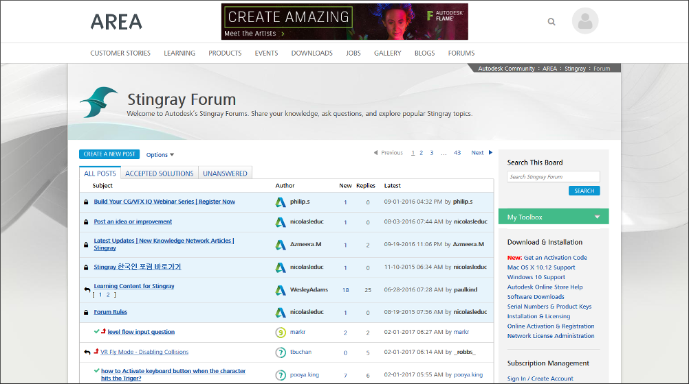
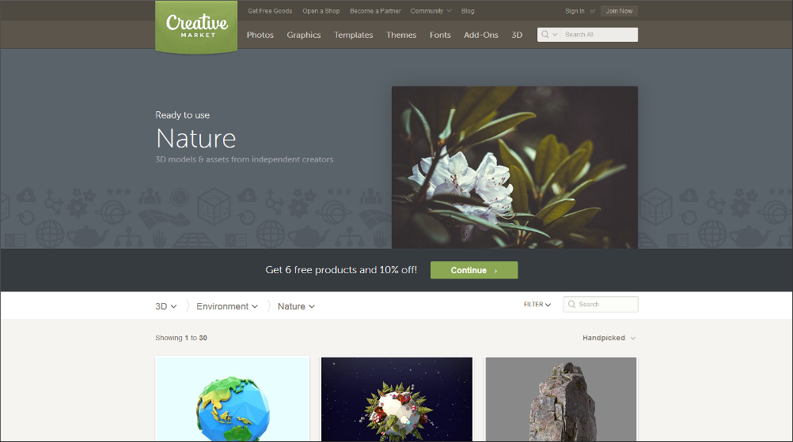
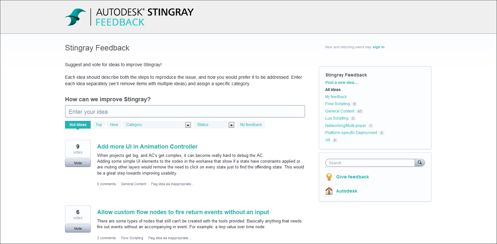
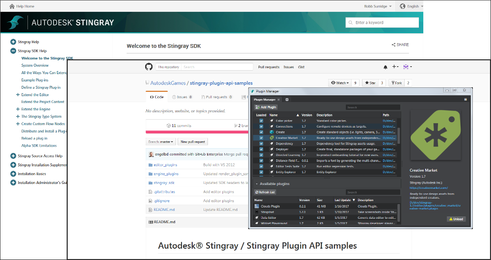

# Get Involved!

Sure, you *could* just use Stingray to make unique interactive and immersive experiences all by your lonesome. But once you get your hands on this tech, we're confident that you'll want to join us in spreading the word, showing off what you've done, and bringing the benefits of your expertise back to the world at large.

Here are a few ways you can pitch in to make the Stingray community a richer, more rewarding place to be...

## Lurk and post in the forums

The [discussion forums](http://www.autodesk.com/stingray-forums) are a great first step into the wider Stingray community. Come and meet some of the other people using Stingray, ask questions, find answers, and get inspired!

We also have evangelists, support people, QAs and developers checking out the forums pretty regularly to look for threads where they can jump in and help out.

## Share your own tutorials

Hopefully, you've already learned a lot by following along with the [Stingray tutorials on the AREA](http://area.autodesk.com/learning/stingray) -- our hub for the creative 3D community. (If not, then kick back with some videos, or follow along using the sample content and project downloads. Check back often, because we're posting new tutorials all the time on new and different use cases.)

Before long, you'll be a Stingray pro -- looking to share your expertise and the cool stuff you're doing back to the community. Create your own tutorials and share what you know with everyone!

Log in to the AREA using your Autodesk ID, head to the **LEARNING** hub, and look for the big blue **Submit your Tutorial** button on the top right:

## Sell your content

Millions of members use [Creative Market](http://creativemarket.com) to buy and sell artwork for their creative projects -- including 3D models, textures, and more. Why not open your own shop and join them? Make money while doing something you love.

Take a look at the [perks](https://creativemarket.com/sell), and see for yourself what's in it for you.

And don't forget: all Stingray users will be able to browse and find your stuff right inside the Stingray Editor, using the Creative Market plugin (choose **Window > Creative Market** from the main menu).

## Tell us your dream features

It may come as a shock, but Stingray doesn't do everything that everybody wants it to do. (Yet.) There are so many ideas and plans and directions it can go -- have your say in what we do next! If there's something nagging you or blocking your project, tell us about it. You never know, there might be other people who will upvote your suggestions and help get them on the roadmap.

Our product managers read this feedback site closely, so it's the best place to go to tell us about what you need.

## Write a plugin

You don't even have to wait for us to put in that killer feature you want -- you can roll up your sleeves and get your hands dirty with our plug-in SDK. Extend the editor with new tools and workflows, extend the runtime engine with new behaviors and new data types, or just package up Stingray assets into reusable, redistributable modules.

Check out the [SDK Help](http://help-staging.autodesk.com/view/Stingray/ENU/?contextId=SDK_HOME) and the [sample repository](https://github.com/AutodeskGames/stingray-plugin-api-samples) to get started.

## Help us improve our docs

We're trying to build out our docs as fast as we can, while keeping all the info up to date and current with the latest Stingray release. But sometimes we make a mistake, forget to update something, or leave a gap where more info is needed. We need your help to point out the problems as you see them, so that we can keep improving. If you see anything -- even as small as a typo -- don't hesitate!

-	You can use the **Was this article helpful?** widget at the bottom of every page to let us know what you think of that content. Once you vote, please do add a quick note about what's missing or why it was useful -- we read them all and act on your suggestions.

-	Most pages have an **Edit this page in GitHub!** button too, which takes you straight to our public GitHub source repository. You can rewrite the pages just the way you want them, and send the changes back to us using the GitHub *pull request* mechanism. For more details, see [the main readme.md file](https://github.com/AutodeskGames/stingray-docs/) in the repo. Happy editing!
