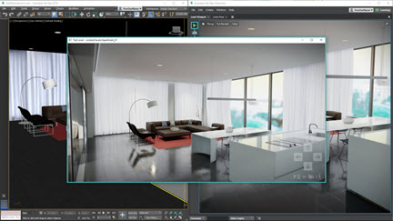

# About 3ds Max Interactive

Based on [Autodesk Stingray](http://www.autodesk.com/stingray-help), 3ds Max Interactive is a real-time engine that gives you tools to create immersive and virtual reality (VR) content. By combining the powerful 3D modeling and animation tools of 3ds Max with new tools for interactive experiences, 3ds Max Interactive aims to give you simple, efficient, and familiar workflows for creating engaging content. With 3ds Max Interactive, you can produce visually stunning games, architectural walkthroughs, or any other immersive, interactive experience. 

---
IncludeIf:
-	MaxInteractive

---
