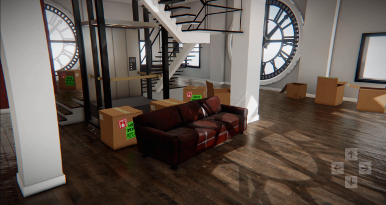
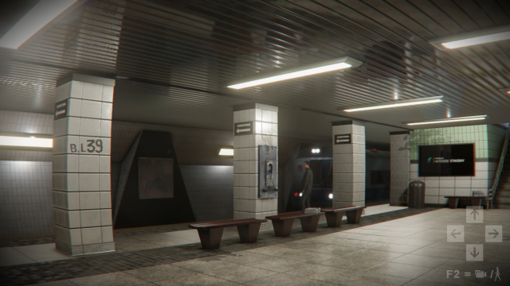

# About Stingray

Stingray is everything you need to create interactive 3D apps and experiences for desktop, mobile, game consoles, and VR/AR devices.

It's already being used to power a growing range of Autodesk products and components, including [Revit Live](https://www.autodesk.com/products/revit-live/overview), [3ds Max Interactive](http://area.autodesk.com/blogs/the-3ds-max-blog/bruno-landry-talks-vr-in-3ds-max), and Maya Interactive (coming soon!) -- and more in development!

If you're looking for add a real-time, VR-ready visualization and interaction component to use in your project, consider adopting Stingray:

-	Bring users closer to their designs than ever before with virtual reality and mixed reality viewports on your 3D data;
-	Build in never-before-seen interactions to give people new ways to create, modify, experience and share their designs;
-	Give your users tools they can use to create their own interactive apps and experiences, to present designs and ideas to their own customers.

The Stingray platform offers a lightweight, real-time simulation engine that visualizes 3D content using a flexible, physically based rendering pipeline. It has a wide range of built-in subsystems and ready-to-use plug-ins that provide a solid base of features you can incorporate and build on: physics, animation playback, networking, audio, AI pathfinding, 2D user interfaces, and more.

The engine is accompanied with a suite of authoring and editing tools that you can use to set up content for the engine to display. Import visual assets authored in other Autodesk design apps, create new assets and special effects, lay out 3D scenes, and more. You or your end-users can set up runtime interactions between the user and the engine with a powerful scripting API, or using a designer-friendly visual programming system.

You can extend both the engine and the editor through a [plug-in SDK](sdk_help.md). Plug-ins can make the system handle custom data types, provide totally new scene editing workflows for users to create content, integrate other libraries and tech components, add template assets, provide additional APIs to the scripting and visual programming layers, and more. See the [SDK documentation](sdk_help.md) for more about what you can do in your own plug-ins.

You can even use Stingray as a platform, creating your own custom-branded deployment. Our tech is being shared as a component between multiple release products, so we've set up a way for product teams to control many aspects of the out-of-the-box user experience, including things like licensing, what plug-ins should be included, and default tool layouts. For more on using our platform this way, reach out to the team. You can find us on Slack at `#stingray`!

---
IncludeIf:
-	Stingray

---
