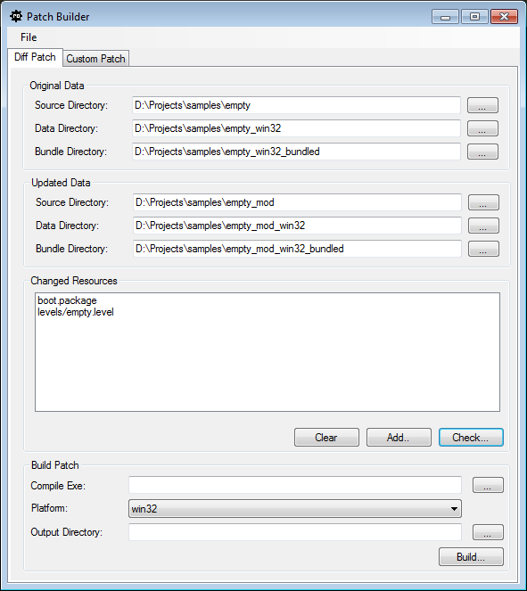

# Patching your app

You can update bundled releases of your app by creating incremental patches that contain new content, bug fixes, and updates to existing assets.

These incremental patches are made up of *patch bundles*. These are bundles of assets that correspond to the bundles originally released with your app, but that contain only files that have been added or modified since you made the original bundles. You install these files alongside the bundles originally shipped with your app, and the interactive engine automatically takes care of loading the latest versions of all your resources.

Each patch bundle is created with a file extension that increments each time you create a patch for that bundle. When the engine loads a resource package, it starts by loading all resources from the latest patch file available. It then loads each previous patch file in turn, skipping any resources that have already been loaded from a later patch file. Finally, it loads all remaining resources from the original bundle.

## Example

For example, suppose that your project contains a package resource named `city_level.package`.

When you bundle your project, all of the resources in this package get combined into a single bundled file named `7d07839294be9576`.

After release, if you update one or more of the resources in this package, you will make a new patch bundle named `7d07839294be9576.patch_0`. This bundle contains only the new and modified resources.

To make the engine use the new and modified resources, you have to install this new patch bundle into the same folder that contains the existing `7d07839294be9576` bundle.

## Creating patch bundles

{{ProductName}} provides a small standalone tool for creating patches, called the Patch Builder.

The Patch Builder tool compares two complete versions of your project. It automatically determines which resources have been added or modified between the two versions, and which packages contain one or more of those modified resources. It then creates a new patch bundle for each of those packages, for use on a target platform that you specify. If a patch bundle for one of those packages already exists in the original version of the project, it generates a new patch bundle with a higher patch version.

Since this process is platform-specific, you must repeat it for each platform that you need to patch.

To create a patch:

1.	Launch the Patch Builder tool from the `tools\patch_builder.exe` file within your {{ProductName}} installation directory. It opens with the **Diff Patch** tab selected, which you will use for this process.

	

2.	In the **Original Data** area, you need to provide the source folder, compiled data folder, and bundled data folder for the version of your project that you want to patch. Note that the compiled and bundled data folders are platform-specific.

3.	In the **Updated Data** area, provide the corresponding source folder, compiled data folder and bundled data folder for the version of your project that contains the newest changes.  Note that the compiled and bundled data folders are platform-specific, and *must* match the platforms you set up for your original data.

4.	Click **Check...**. The **Changed Resources** list will show all the resources that have been modified in the updated project data.

	If the automatic scan has missed any files that you know have changed, or if you want to force any other files to be included, you force selected resources to be treated as modified. Click the **Add...** button to select them. In most cases, however, this should not be necessary.

5.	Set the **Compile Exe** field to point to the version of the interactive engine that you want to use in order to compile the files. Typically you should use the development build of the latest version of {{ProductName}} you have installed.

6.	Set the target platform for the new patch bundles. This must correspond to the platform of the compiled and bundled data you provided in steps 2 and 3 for the original data and updated data.

7.	Set an output directory in which the Patch Builder will create the patch bundles, and click **Build**.

The patch builder creates the patch bundles in the specified directory. Packaging and distributing these files so that they end up installed at the correct location with the rest of your released data is up to you.

## Creating patch bundles manually

You can create a custom patch bundle for your current project by specifying on the **Custom Patch** tab exactly which resources should be included. This process is not typically recommended for general use, as it can only create bundles for Windows platforms.
