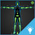

# HumanIK character setup

To take advantage of HumanIK in {{ProductName}}, each game character needs to have a valid HumanIK skeleton definition.

You create a valid skeleton definition for the character during the rigging process in Maya, Maya LT, or MotionBuilder, then export the character as an FBX file. For detailed information on setting up a HumanIK character and creating the skeleton definition, refer to the HumanIK documentation in your content creation package.

When exporting the character FBX file from Maya or Maya LT, enable the **Skeleton Definitions** option in the **FBX Export Options** (under **Constraints**) to ensure the file contains the required characterization data. In MotionBuilder, enable **Characters** in the **Save Options**.

After importing the character to {{ProductName}}, you can confirm that HumanIK detected the character definition data correctly by checking for a .character file in the 'content/units' folder of your project (or wherever you imported the character). If the imported FBX file contains a valid skeleton definition, HumanIK creates a "CharacterName.character" file alongside the character unit.

> **Tip:** You can also test or debug the character structure by enabling XRay mode, using Lua or Flow. In XRay mode, when you test the level (press F8), you can view character rigs exactly as HumanIK sees and evaluates them.

<table class="not-ruled"><tr><td>

</td><td>
Want to play around with some fully set up HumanIK characters? Open the sample HumanIK project from the **Online Projects** tab of the **Project Manager**, or [download the project here](https://gamedev.autodesk.com/stingray/plugins/humanik-project_example)!
</td></tr></table>
