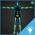

# HumanIK sample project and common use cases

HumanIK can help you accomplish any inverse kinematic animation that you need in a project: for example, you can make a character grab an object on the ground, open a door, aim a weapon, or look other characters and points of interest in the scene.

<table class="not-ruled"><tr><td>

</td><td>
The best way to learn about HumanIK in {{ProductName}} is to get your hands on the HumanIK example project. Open the sample HumanIK project from the **Online Projects** tab of the **Project Manager**, or [download the project here](https://gamedev.autodesk.com/stingray/plugins/humanik-project_example)!
</td></tr></table>

The sample project illustrates some of the most common use cases, including:

 - Floor Contact
 - Aiming
 - Looking At
 - Reaching
 - Finger IK

But there are many more! We recommend that you download the project and start to experiment with the sample project as you prepare to work with HumanIK on your own game.
