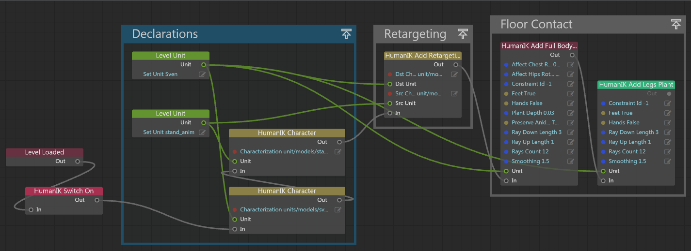

# Example: HumanIK through Flow

Everything described in ~{ Set up floor contact using HumanIK }~ can also be set up to happen when the **Event > Level Loaded** event gets triggered in a level flow graph.

In order to replicate that behavior, you could compose a level flow graph looking like this:

As you can see, there are 4 sections in the graph. We'll refer to these as **Switch On**, **Declarations**, **Retargeting**, and **Floor Contact**.

###1. Switch On

A single **HumanIK > Setup and Debug > HumanIK Switch On** node turns HumanIK on when the level gets loaded.

(HumanIK is disabled by default.)

###2. Declarations

This section lets you declare characters to the HumanIK plug-in.

Create **HumanIK > HumanIK Character** nodes to declare character units to HumanIK. These take two inputs:

- the unit they are controlling (characterName for the first node, the motion clip for the other node)

- the *.character* resource containing the characterization data for each of the units

The resource name is usually similar to the level unit name; it is just prefixed with `units/`.

Do not specify the *.characterization* extension.

###3. Retargeting

Consists of a single **HumanIK > Character Retargeting > Add Retargeting** node.

Inputs are the source and destination units and the character resources. Source is the motion capture unit, destination is *characterName*.

###4. Floor contact

Two nodes have to be defined for the floor contact to work; a full body plant node first, then a legs plant node.
