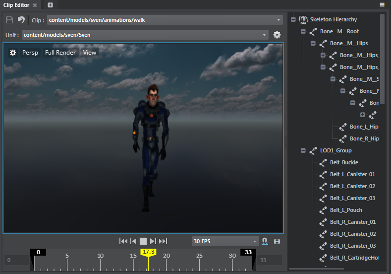

# Animation Clip Editor

- **Window > Animation > Clip Editor**

This editor lets you modify animation clips.

Double-click a clip in the **Asset Browser** to load it in the editor.

>**Note:** You can trim animation clips in the timeline of the **Clip Editor**.

---
Related topics:
- ~{Add beats and flow events to animation clips}~
- ~{Trim animation clips}~
---
