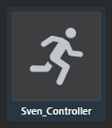

# Animation controllers

An animation controller is the mechanism that lets you set up a layered animation system for your character, defining various states of motion, the events that can trigger those states, and how the transition between the states occur. The animation controller also gives you variables to control the animation speed and mixing.

You can use animation controllers to implement complicated animated behaviors. They are created using the **Anim Controller** Editor, and applied using the **Unit Editor**.

An animation controller is associated with a skeleton, and any unit that uses that skeleton can use that animation controller.

To create an animation controller, right-click the skeleton of a character unit in the **Asset Browser**, then select **Create Animation Controller** from the pop-up menu.

To set the animation controller on an existing unit (which uses the same skeleton as the animation controller), select the unit in the **Asset Browser** and choose the animation controller from the drop-down in the **Property Editor**.

## Animation controller concepts

This section gives you a brief overview of the various components that make up an animation controller.

<dl>

<dt>States</dt>

<dd>A state is a behavior that the character can be occupied with (for example *Running*). The state is associated with a particular animation (the running animation) and can transition to other states (such as *Walking* and *Idle*) through events. See ~{ Animation controller states }~ for details on the different types of states.

You can drag and drop states into groups in the **Anim Controller Editor**’s **Tree View** and **Node Graph**, letting you organize states in the hierarchy. For example, you can drag a selection of states over a group state to move the states, along with any associated transitions, into the group.

<dt>Layers</dt>

<dd>The animation controller is organized in a number of layers. Each layer is comprised of a state machine where exactly one state is active.

When there are multiple layers, animations in the top layers override animations in the bottom layers. For example, while a Running animation is played in the base layer, a Look left animation can be played in a higher layer. The eye animation in the higher layer will override the eye movement in the lower level. Using this method you can create multiple layers for controlling different parts of the body.

You can drag and drop states into layers in the **Anim Controller Editor**’s **Tree View** and **Node Graph**, letting you organize states in the hierarchy. For example, you can drag a selection of states over a layer  to move the states, along with any associated transitions, into the layer.

See also ~{ Animation controller layers }~.

</dd>

<dt>Transitions</dt>

<dd>A transition specifies what happens when the engine goes from one state to another. Transitions are triggered by anim events and they specify how the animation should be blended from the ‘from state’ to the ‘to state’. See ~{ Animation controller transitions }~.</dd>

<dt>Notes</dt>

<dd>Notes are just pieces of text that you can add to the state graph for documentation purposes.</dd>

<dt>Anim Events</dt>

<dd>Named actions that can be sent to the animation controller from a Lua script or Flow. On receiving an anim event, the animation controller may transition from one state to another. (Anim events are identified by their names, and cause transitions between animation states.) For example, from a Running state to a Jumping state. See also ~{ Script interface for animation }~.

Right-click **Anim Events** in the **Anim Controller** Editor tree view to create new anim events.

You can also test anim events using the Preview Controls in the **Anim Controller** Editor.

</dd>

<dt>Variables</dt>

<dd>A variable is a named item that can take on numeric values. It can be changed at runtime through Lua and Flow and is used in expressions to control animation behaviors, such as running_speed. The animation controller can decide how to mix animations together based on these variables. For example, it may play a mix of a walking and a running animation based on the running_speed variable and also use that variable to control how fast the animations are played.

<dl>
<dt>Default Value</dt>
<dd>The default value of the variable. This is the value the variable will have unless changed at runtime.</dd>

<dt>Min Value, Max Value</dt>
<dd>Provides a useful range for the variable for control in the Preview Controls. The variable is not forced to stay within these values, the script can set it to a value outside the min/max bounds.</dd>

</dl>

</dd>

<dt>Expressions</dt>

<dd>An expression is a small mathematical expression using numbers and state machine variables, for example, these are all expressions:

-   `1`
-   `run_speed`
-   `0.5 + 0.2*run_speed`

In some places in the animation controller (for example, in the custom blend state) you can use expressions instead of just numbers to produce more advanced behavior.</dd>

<dt>Blend set mask</dt>

<dd>A blend set mask provides a weight (0-100%) for each bone in the animation controller. Use blend set masks to determine which bone poses get overridden by higher layer animations. For example, a layer intended to control eye movement uses a blend set mask that only includes the eye bones.

Each state can have a blend set mask specified. (The default state of a blend set mask is all bones.) So different states can make different decisions about what bones they want to override. For example, you can have one state to control just the eyes, and another to control the entire body.

You define a blend set mask for a skeleton by setting the weight of each bone using the **Skeleton Editor**. Note that you can select multiple bones in the list to change their weight simultaneously.

</dd>

<dt>Constraint targets</dt>
<dd>A constraint target is very similar to a variable. But instead of specifying a numeric value, it specifies a position in 3D space that can be set from the Lua script.

The constraint target is used as input to the animation controller's constraints.

The constraint targets show up in the animation preview as things you can grab and move around.

<dl>
<dt>Position XYZ</dt> <dd>The position of the constraint target when the animation is previewed.</dd>
<dt>Color<dt/> <dd>Sets the color of the object you can grab and move around in the **Asset Preview** to adjust the constraint target.</dd>
</dl>

</dd>

</dl>

---
Related topics:
-	~{ Set up a character }~
-	~{ Set up an animation controller }~
-	~{ Anim Controller Editor }~
---
