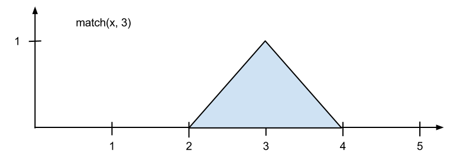
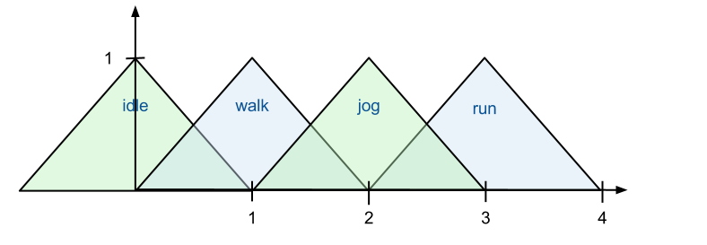

# Custom blend states

<dl>

<dt>Animations and Weights</dt>

<dd>Lists the different animations that this state will mix together and the weight of each animation in the mix. For example if three animations are mixed together with weights 0.7, 0.2 and 0.1 the end animation is a mix with 70% of the first animation, 20% of the second and 10% of the third.

The weight is an *expression*, so it can use *variables* and mathematical expressions.

The mathematical language used for expressions has four functions for facilitating blend states that mixes different animations based on the value of a variable:
 *match()*, *match_2d()*, *match_range()* and *match_range_2d()*</dd>

<dt>match(variable, constant)</dt>

<dd>

This is a sawtooth function that is 1 when the variable matches the constant. It falls off to zero within a distance of 1 from the constant value. If you are further away, the function is zero.

You can use this to switch between a set of animations based on the value of a variable:

  walk      match(speed, 0)
  jog       match(speed, 1)
  run       match(speed, 2)

Now you can select which animation to use with the speed value. A value of 1.3 will blend 70% of the jog animation with 30% of the run animation.
Note that for this to work, the constant values that you match against must increase by 1 for each animation. This guarantees that the sawtooth shapes match up so that the jog animation starts to increase when the walk animation starts to fade out.</dd>

<dt>match_2d(variable_1, constant_1, variable_2, constant_2)</dt>

<dd>Corresponds to the 2D blend space state.

This function works the same as *match()*, except it matches two variables at once. So you can pick an animation for example based on both run speed and whether the player leans left or right. Essentially you are picking animations from a grid:

|LEFT RUN (2,-1)|RUN (2,0)|RIGHT RUN (2,1)| |LEFT JOG (1,-1)|JOG (1,0)|RIGHT JOG (1,1)| |LEFT WALK (0,-1)|WALK (0,0)|RIGHT WALK (0,1)|

An input value of (1.3, 0.5) would result in a blend of:

| Blend  | Animation |
| ---------- | ---------- |
| 35%	  | JOG  |
| 35%	 | RIGHT JOG |
| 15%	 | RUN |
| 16%	 | RIGHT RUN |

</dd>

<dt>match_range (variable, t0, t1, t2)</dt>
<dd>This function works in a similar way to *match()*, but lets you reshape the sawtooth.</dd>

<dt>match_range(x, t0, t1, t2)</dt>
<dd>Gives you a sawtooth which is at 0 % when x == t0, ramps up to 100 % when x == t1 and ramps back down to 0 % when x == t2.

match(x, t) is the same as match_range(x, t-1, t, t+1).</dd>

<dt>match_range_2d (variable_1, t0, t1, t2, variable_2, s0, s1, s2)</dt>

<dd>This function works as match_2d(), but lets you specify the shape of the sawtooth for each variable, just as you can do for one variable with match_range().

You don't have to use the match() and match_2d() functions to set up a blend state. You can use whatever mathematical expression you like. These functions are just there to facilitate the common cases.

In addition to the match functions, the expression system also supports: +, -, **, /, sin, cos* and abs.</dd>

</dl>

---
Related topics:

- ~{ Animation controller states }~

---
