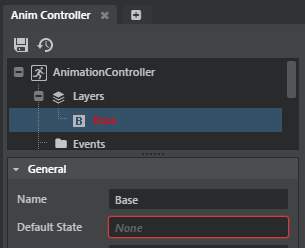
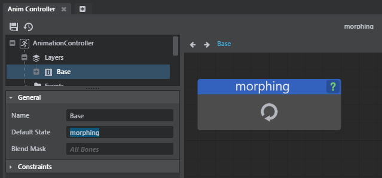
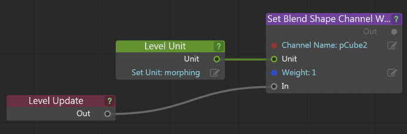
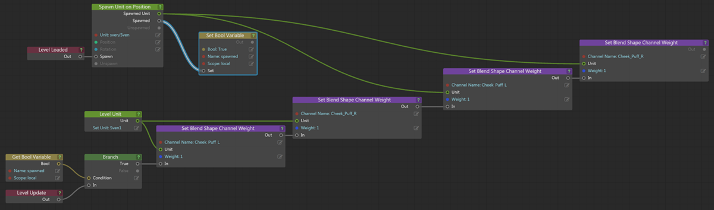

# View animated blend shape targets

After you create blend shapes in your DCC tool and import them into {{ProductName}}, any animated target shapes you added to your base object in your DCC tool are not automatically visible. You can use animation controllers or flow to set up your animation in {{ProductName}}.

## View the animated targets in {{ProductName}} using animation controllers

1.	In the **Asset Browser**, right-click your imported unit and select **Create Animation Controller**.

1.	Double-click **yourname.anim_controller**.

	In this example, the animation controller is named morphing.anim.controller.

1.	Enter a name for your animation controller and click Ok.

1.	In the ~{ Anim Controller Editor }~ that appears, delete any nodes that appear in the node graph.

1.	In the Tree view, select the **Base** layer.

	

1. In the **Asset Browser**, navigate to your animation folder, and drag and drop the imported anim_clip file into the **Anim Controller Editor**'s node graph.

1. In the Tree view, select the **Base** layer and ensure the **Default State** is set to your anim_clip file.

	

1. Click  to save your changes.

	Your animation appears in the animation preview .

1. In the **Asset Browser**, drag your unit into the level to see the animation playback on your object.

## View the animated targets in {{ProductName}} using Flow

In order to replicate the behavior that you have in your DCC tool, you can compose a level flow graph that looks like the following images.

Do one of the following to use Flow with your targets:

-	Use Flow with a **Level Unit** node.

	Set the **Level Unit** to your imported blend shape, and set the **Channel Name** to one of your target shapes.

	

-	Use flow with spawning.

	

	This flow graph features a character as the blend shape with targets that each represent a different facial expression.
