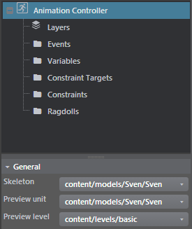
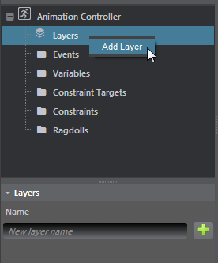
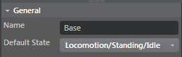
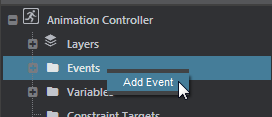
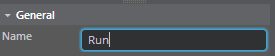
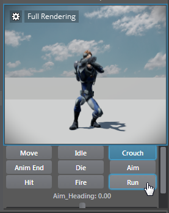
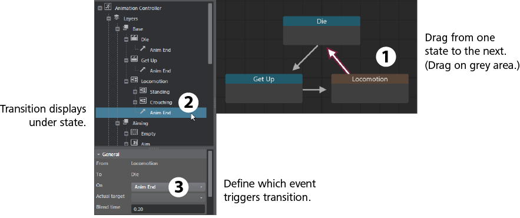
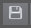

# Set up an animation controller

See also ~{ Animation controllers }~.

##Step 1: Create the Animation Controller

1. In the **Asset Browser**, right-click a character skeleton then select **Create Animation Controller** from the pop-up menu.

2. Double-click the **Animation Controller** to open the ~{ Anim Controller Editor }~.

	In the **General** properties, notice that the **Skeleton** drop-down is automatically set to display the skeleton you selected, and the character unit is selected as the **Preview unit**.

	These properties define global options for the animation controller (and the preview window).

	<dl>
	<dt>Skeleton</dt>
	<dd>Specifies the skeleton that the animation controller uses. This skeleton includes the blend masks.</dd>

	<dt>Preview unit</dt>
	<dd>The unit that the animations will be played on in the preview windows.</dd>

	<dt>Preview level<dt>
	<dd>To complete the picture that displays in the Animation Preview panel, select the level where you want to preview units.</dd>

	

 	The Animation Preview panel updates to reflect your selections. As you add animation clips in the following steps, you can preview them accurately there.

##Step 2. Set up layers

1. Expand **Layers** in the tree view.

	By default, a "Base" layer is already created for you. To add new layers, right-click and select **Add Layer**.

	

2. (Optional) Rename the Base layer in the **Name** field, in the properties panel below.

##Step 3. Add states to the layer for each animation clip

1. Expand the "Base" layer.

	By default, the Base layer includes one state called 'Empty'.

3. Right-click a layer and select **Add New State > Clip State**.

	The first state node displays in the preview panel, along with all the state options below.

2. Rename the state to reflect the animation clip it represents.

3. Add an animation clip to this state.

	In the properties panel, click the **Add Clips** field in the **Animations**, then select from the list of clips.

4. Repeat these steps to add as many states as you want, renaming the states, and adding their animation clips.

	> **Tip:** You can also right-click in the layer preview panel and select Add State.

	For a simple setup, you may require only a single clip in a single state.

5. Set the default state for the current layer.

	This is required. With the layer selected, select a state from the **Default State** drop-down in the properties panel.

 	

###Step 4. Add events to trigger each state

You'll add an event for each of the animation clips you want the controller to include. If your setup includes only one clip and you don’t need to blend between states, you can skip these steps.

1. In the left panel, right-click **Events** and select **Add New AnimEvent**.

 	

2. Rename the event in the Properties panel.

	

	The event is also added to the preview panel (seen after you save the animation controller), where you can select it to view the effect on your character.

	

###Step 5. Add transitions between states

1. In the node graph area, drag from one state to the next (dragging on a grey part of the node).

	This adds a transition that displays under the state.

2. In the transition settings (on the properties panel), under the **Conditions** category select an event from the **On** drop-down list .

	

	The transition settings now read: From State: `clipX` To State: `clipY` On: `event`.

> **Tip:** Drag and drop a selection of states over a group state or layer to move the states and any associated transitions.

###Step 6. Save the animation controller

1.  Click the Save icon .

	Always save the animation controller in the same folder as your character: for example, `content/models/*characterName*/`.
