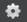

# Skeleton Editor

-	**Window > Animation > Skeleton Editor**

You can use the **Skeleton Editor** panel to control fine details of the way a character's skeleton responds to animation clips, blending, and animation playback in the engine at runtime.

There are three main things you can set up in this panel:

-	Choose which nodes in the skeleton should be animated and which should not.
-	Set up levels of detail for your skeleton.
-	Create and manage animation blend masks.

You switch between these three editing modes using the drop-down list at the right side of the panel. Depending on which editing mode you have selected, the tree view of your skeleton looks slightly different and offers a different set of editing controls.

## Enable or disable animation per node

Choose **Skeleton** in the drop-down list to set which of your skeleton's nodes should be animatable and which should not.

When you disable a node, it will never play any animation contained for it in any animation clip that you play on that skeleton. It will freeze in local space. Disabling nodes that you don't need to animate can be useful in order to optimize the memory and performance of the animation system.

-	 identifies each enabled node.
-	 identifies disabled nodes.
-	Right-click any node to toggle it, or to toggle all of the nodes under it in the skeleton hierarchy.
-	Use the **Disable all Non-Animated Nodes** button to turn off animation for any nodes that are not used in any of the animation clips currently used with your skeleton.

## Assign nodes to different levels of detail

Choose **Level of Detail** in the drop-down list to set which of your skeleton's nodes should be animatable at each different level of detail.

Levels of detail can help you increase the performance of the animation system by disabling animation for pre-defined sets of nodes in the skeleton at different times or in response to different runtime circumstances.

Each level of detail enables animation for a sub-set of nodes in the skeleton. When you activate that level of detail for a unit's skeleton in the engine at runtime, that set of nodes is enabled *in addition to* all nodes that are enabled at less detailed levels.

See the details on the ~{ Animation optimization }~ page for more.

-	Swap the level of detail you want to focus on by selecting it from the **LOD** drop-down list.
-	 identifies nodes that are enabled in the level of detail that you currently have selected in the **LOD** drop-down list.
-	 identifies nodes that are turned off in the level of detail that you currently have selected in the **LOD** drop-down list.
-	Empty circles identify nodes that are not enabled at *any* level of detail.
-	Right-click any node in the list to toggle it on or off in the current level of detail, or to toggle all nodes under it in the skeleton hierarchy.
-	Each node in the skeleton hierarchy also shows the first level of detail at which it becomes enabled.

## Manage blend masks

Choose **Blend masks** in the drop-down list to set up your skeleton's blend masks, which control the blending between different animation layers that are playing at the same time on a skeleton.

Each blend mask stores a weight value for each node in the skeleton. You can assign one of these blend masks to each animation state in the animation controller that controls this skeleton. When you have two or more animation layers that need to play different states on the same skeleton at the same time, the blend mask that is assigned to each state controls how strongly that state is weighted when coming up with the final result for the skeleton in each frame:

-	If the opacity value for a node is 0%, or fully off, the current animation state does not contribute to the animation result for that node at all. Only the other animation layers and states will be taken into account when animating this node.
-	If the opacity value for a node is 100%, or fully on, the current animation state completely overrides the animation for this node produced by all animation states that are contained in all other animation layers lower in the animation controller's stack of layers.
-	Values in between 0 and 1 cause the node's animation state to blend in on top of the result produced by other animation layers that are lower in the animation controller's stack.

Use the control strip at the top of the panel to manage the blend masks that are available for this skeleton, and to select a blend mask whose weights you want to edit:

-	Each node in the skeleton hierarchy is displayed with its current weight value expressed as a percentage. The circle icon gives a visual hint of the percentage.
-	Right-click any node in the hierarchy to set the opacity percentage value for that node, or for all nodes under it in the skeleton hierarchy.

## Save or undo changes

Use the icons at the top left of the panel to apply and undo the changes you make to your skeleton.

| Icon  | Action |
| ------------- | ------------- |
|   | Save your changes. |
|   | Revert to the last saved version of the skeleton, losing any changes you've made in this panel. |

## Change skeletons

If you want to modify a different skeleton, choose any skeleton in your project from the **Skeleton** drop-down list.

## Change the preview

The viewport of the **Skeleton Editor** panel shows a preview of the changes you make to your skeleton's animation settings. You can use the preview controls to change what you see in the viewport:

-	A skeleton can apply to multiple units in your project. By default, the panel will choose one of those units to show in the preview viewport. You can use the **Unit** drop-down list to change to a different unit.

-	Use the **Anim** drop-down list to choose which animation clip you want the preview viewport to play on your chosen unit.

-	Use the settings icon  to control other display settings for the preview viewport, such as the playback rate, whether to evaluate the selected unit's Unit Flow graphs, and whether to enable physics.

-	Use the timeline control at the bottom of the panel to start, stop, and scrub the current animation clip.

None of these settings affect the skeleton resource itself. They only change the preview that you see in the viewport.
