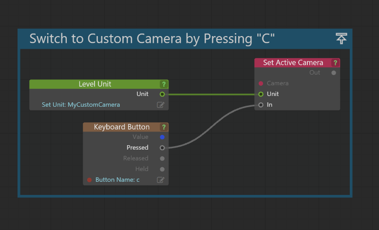

# Cameras in Stingray

Cameras in Stingray are your way of viewing your game world. Because they are necessary to see your world at all, they are one of the most essential parts of Stingray. Every game has at least one camera but often games will have many.

>  For video tutorials on controlling game cameras, check out <a href="http://area.autodesk.com/learning/series/controlling-game-cameras-in-stingray" target="blank">Controlling Game Cameras in Stingray</a>.

## Switching cameras

1. Create a camera from the ~{ Create panel }~.

2. In the **Flow Editor**, assign your camera as the active camera.

  	

3. Click the Play icon  in the ~{ Toolbar }~, and you can now press C to assume your new camera.

## Setting clipping planes

By default, Stingray sets up clipping planes with expected distances for general real world scale. This may not be ideal for your project and sometimes you'll need to adjust your clipping planes accordingly.

**To adjust clipping planes in the viewport:**

1. Click the gear icon in viewport, then select **Viewport Options**.
2. Set the **Near Range** and **Far Range** according to your needs.

**To adjust clipping planes in-game:**

In **Level Flow**, access the camera with the Get Current Camera node, then use the Set Near Range and Set Far Range nodes to set distances as needed.

## Moving cameras

You can control camera movement with many different methods.

-	Use Story to animate cameras. See ~{ Create simple animations with the Story Editor }~.
-	Use Flow or Lua to move the position of cameras. See the Camera category in the [Stingray Flow Node Reference](../../flow_ref/index.html) or [Stingray Lua Reference](../../lua_ref/index.html).
-	Link cameras to units that have animated paths or motion.

## Storing the template start camera

The default “fly mode” cameras found in some of the default Stingray ~{ Template projects }~ can be useful to switch to and from. Unfortunately, because they are not level units they can be tricky to get at. You can use this simple bit of Flow code to store those cameras for use later on. Use this trick to store any camera so that you can return to it.

  
