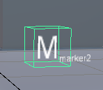
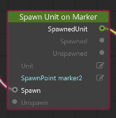
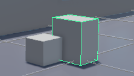
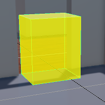
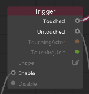

# Create game objects

Game objects in Stingray are basic primitives that you can use to set up game logic. They're represented visually in your level so you can see their position in 3D.

They give you the simple hooks you need to trigger events using Flow and Lua at specific locations in your level.

Using the **Create** menu  or the ~{ Create panel }~, you can create the following game objects.

- **Markers** Display as wireframe cubes with the marker name. Used to locate a position in your level so you can make actions happen at that location.

	

	For example, you can spawn a unit at a given marker.

	

- **Prototypes**. Simple, adjustable 3D blocks that let you rapidly develop geometry in order to rough out level elements. You can also use prototypes to create invisible physics actors. (See ~{ Create a physics actor }~.)

	

- **Triggers** are also simple 3D blocks, but they're set up to act as a switch, so that you can trigger events when other objects come in contact with them.

	

	After you add the trigger to your level, add an **Event > Trigger** node to the level flow graph, and set the behaviors you want for Touched and Untouched states.

	

-	**Volumes** are 3D blocks that are used for tagging the navigation mesh. See ~{ Generate navigation mesh }~.

- **Splines** are 3D curved paths, used for constricting motion. The path information is accessible using Lua scripting and Flow nodes.

##Cancelling creation mode

When you select a component to create, the create mode stays active until you use a cancelling process:

- Right-click
- Press Esc
- Select a different sub-component from the **Create** menu
- Select something in the ~{ Toolbar }~ or **Asset Browser**
