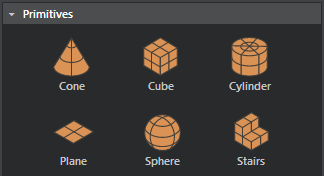

#Create primitives

Primitives are simple shapes, 1-meter square by default, that you can use to prototype scenes quickly.

 1. Do either of the following:
	- From the main menu bar, select **Create > Primitives > Cone**. (Cone, Cube, Cylinder, Plane, Sphere, or Stairs).
	- In the **Create** window (**Window > Create**), switch to the **Objects** tab and select units from the **Primitives** section.

    

2. In the **Level Viewport**, click to place instances of the selected primitive.

  You can then use the Move, Rotate, and Scale tools in the ~{ Toolbar }~ to modify primitives, or open the ~{ Property Editor }~ to set precise values.
