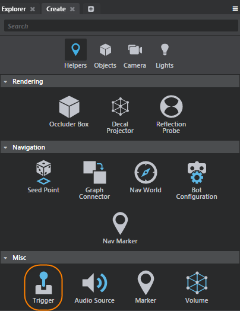

# Create a trigger

Triggers (or trigger volumes) are simple game objects that let you trigger events when other objects come in contact with them.

Triggers are used for gameplay interaction in levels, and you can think of triggers as switches. When something enters or exits the trigger volume, the switch is activated and an action occurs. You can access triggers using flow nodes or Lua scripts.

>  For video tutorials that illustrate how you can use trigger objects, check out <a href="http://area.autodesk.com/learning/trigger-a-door-opening" target="blank">Trigger a door opening</a> or <a href="http://area.autodesk.com/learning/triggering-sound-and-particle-effects" target="blank">Trigger audio and particle effects</a>.

1. Open the **Create** window (**Window > Create**).

2. In the **Create Window** select the **Helpers** tab, then select **Trigger** under the **Misc** category.

	

3. In the **Level Viewport**, drag to set the width and length of the trigger.

4. Release to commit the base.

5. Drag up or down to set the height.

---
Related topics:
-	~{ Trigger properties }~
-	'~{ Example workflow: Trigger a door opening }~'
---
