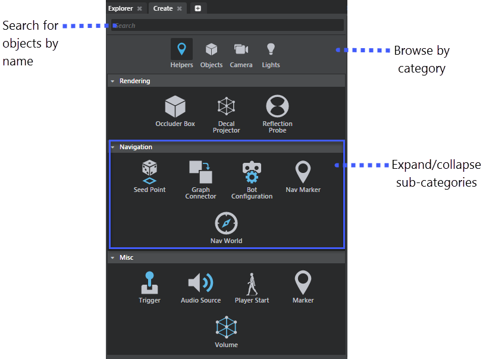

# Create panel

- **Window > Create**

Lets you create standard level objects that can be placed and modified in the level. See also ~{ Create level objects }~.

Search for the object name, or browse by category of object.

## Helpers

The **Helpers** tab in the **Create** panel lets you create components from the following categories:

### Rendering

**Occluder Box**

Creates an occluder box that you can use for occlusion culling. See ~{ Create occluder boxes }~.

**Decal Projector**

Creates a decal box object that you can use to project decal textures onto surfaces in the level. See ~{ Project a material as a decal }~.

**Reflection Probe**

Use reflection probes to establish the basic lighting scheme in a level.  See ~{ Reflections }~.

### Navigation

See also  ~{ Gameware Navigation }~ and ~{ Set up levels to use Gameware Navigation }~.

**Seed Point**

Seed points let you define the walkable areas of the terrain in your level.

When you place one or more seed points in a level, navigation data is only generated for areas that are accessible from those seed points. By placing seed points in areas where you don't want your NPCs to be able to walk, like rooftops, or barriers, you can reduce the amount of navigation data you generate for your level.

See also ~{ Generate navigation mesh }~.

**Graph Connector**

Lets you connect portions of the NavMesh together, for example when you need to join two edges for things like ladders, or elevators. Place the Graph Connector in your level, then  translate, rotate and scale it as necessary. At runtime, this unit automatically generates a set of NavGraph to join two ledges.

See ~{ Set up levels to use Gameware Navigation }~.

**Nav World**

This is the main component to integrate if you're setting up navigation in your level. It helps you generate navigation data and makes that navigation data get automatically packaged up with the level.

See ~{ Integrate Gameware Navigation into your project }~.

**Bot Configuration**

This unit lets you configure path finding, avoidance, and shortcut and trajectory behaviors for a navigation bot.

**Nav Marker**

This unit lets you add navigation points for the navigation bot to follow.

### Misc

**Trigger**

You can think of triggers as switches. When the switch is activated (something enters or exits the trigger volume) an action can occur. You can access triggers using flow nodes or Lua scripts. See ~{ Create a trigger }~.

**Audio Source**

Creates an audio source unit. Place this unit in the level to play an event whenever the audio listener enters the Source shape area.

See also ~{ About audio sources }~ and ~{ Wwise Workflow Tutorial }~.

**Marker**

Markers are used for locating a position in your level so you can make actions happen at that location. For example, you can spawn a unit at a given Marker. See ~{ Create markers }~.

**Volume**

~{ Create a volume }~.

## Objects

### Primitives

Primitives are simple shapes, 1-metre square by default, that you can use to prototype scenes quickly. See ~{ Create primitives }~.

### Objects

**Terrain**

Use terrain tool to create and model a landscape in the level. See ~{ Create terrain }~.

**Empty Entity**

An empty entity is an entity with no components and inherited assets. See ~{ Create a new entity asset }~.

**Prototype**

Prototypes are simple cuboids with adjustable size and shape properties. Use them to develop geometry rapidly and rough in the elements of your scene before you have final artwork. They are also useful for creating invisible physics actors. See ~{ Create prototypes }~.

**Spline**

Splines are user-generated 3D curved paths, commonly used for constricting motion. See ~{ Create splines }~.

## Camera

### Camera

Lets you create a standard camera. See also ~{ Cameras }~.

## Lights

### Physical Light

Lets you create a physical light entity. See also ~{ Physically Based Lighting }~ and ~{ Create a physical light }~.

### Light

Lets you create a standard light. See also ~{ Create a light source }~.
