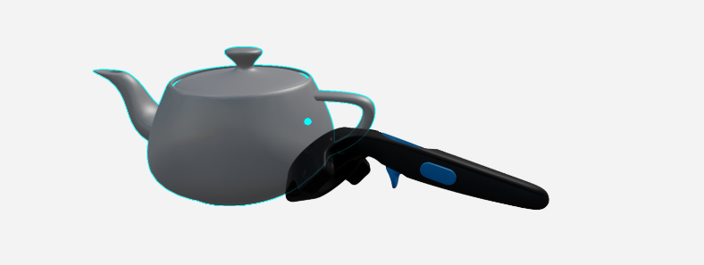
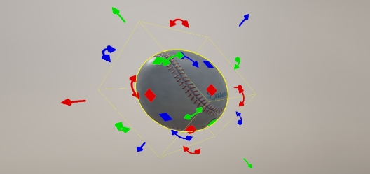
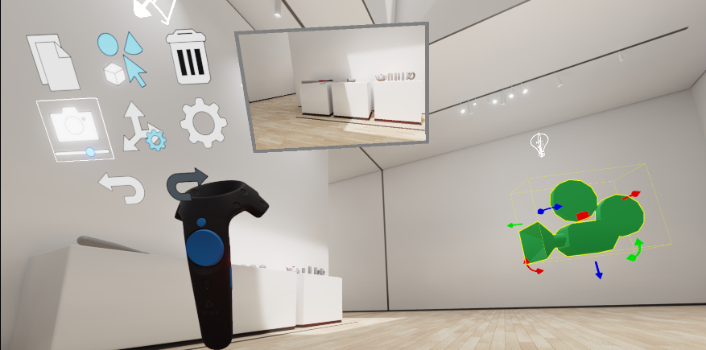

# Work with level objects in VR

This page describes how to modify your level in VR by transforming, cloning and deleting level objects such as units, lights, and cameras.

## Select objects

You can select as many level objects as you want at any time. Selected objects are highlighted in **yellow** in your VR view.

>	**Tip:** You can select any object in the level as long as your head is not inside that object. For example, while you're inside a room whose walls, ceiling and floor are all contained within a single unit, you are able to select and move all of the objects inside the room with you, but you are not able to select and move the walls, ceiling and floor. If you want to be able to move the walls, ceiling and floor, you can either navigate the level so that your head is outside the room (by teleporting or scaling), or import them into 3ds Max Interactive as separate units.

**To select a single object:**

1.	Point your laser cursor at a selectable object in the scene, or move your right-hand controller close to an object to switch to the point cursor.

	The object is highlighted in blue.

1.	Press the right index trigger to select the highlighted object.

**To select multiple objects:**

1.	Enable multi-selection mode, either by holding down the left trigger, or by activating the multi-selection setting in the VR menu.

1.	Use either the laser cursor or point cursor to highlight the object in blue.

1.	Press and release the right index trigger to add the highlighted object to your selection.

**To de-select a single selected object:**

1.	Enable multi-selection mode, either by holding down the left trigger, or by activating the multi-selection setting in the VR menu.

1.	Use either the laser cursor or point cursor to highlight the object you want to remove from your selection.

1.	Press and release the right index trigger.

**To clear all selected objects:**

1.	Point your laser cursor in a direction where it does not intersect any selectable objects.

1.	Press and release the right index trigger.

OR, activate multi-selection mode and de-select the objects one-by-one.

## Transform selected objects

You can transform selected objects in 3D space by moving, rotating, and scaling them.

>	**Note:** Auto-parenting mode is always enabled for VR editing. That means that whenever you transform an object, you will also transform any other level objects that are either sitting on top of your selected object, or that are enclosed entirely within the bounding box of your selected object. These "child" objects are indicated by a dark blue highlight.

**To transform by grabbing directly:**

The most intuitive and straightforward way to move and rotate an object is to grab it and move it by hand.

1.	Teleport or move close enough to the object that you can touch it. See ~{ Navigate in VR }~.

1.	Move your right-hand controller close to the object until the point cursor appears.

	

1.	Press and hold down the right index trigger to select the object and keep it grabbed.

1.	Move your controller to drag the object to a new position and rotation in the scene.

Note that when you grab an object directly:

-	the transform tools that you have selected in the VR menu are not taken into account. You can always move and rotate a selected object by grabbing it, but you can't scale it.

-	the snap settings that you have selected in the VR menu *are* taken into account, *except* for the **Snap to Grid** option.

**To transform using object manipulators:**

When you have one or more objects selected, you will see a set of manipulators drawn around your selection. The manipulators you see, and therefore the transformations you can apply to the object, depend on the tools that you have selected in the [object manipulation settings](vr_controls.html#object-manipulation-settings) area of the VR menu.

-	Straight arrows are translation manipulators. Drag one of these arrows to move the object back and forth in the direction of the arrow.

-	Curved arrows are rotation manipulators. Drag one of these to rotate the object around its center on the plane defined by the arrow.

-	Squares are scale manipulators. Drag one of these to increase or decrease the size of the object along the axis you choose.

	

You can move manipulators using the laser cursor, or by grabbing them.

1.	Point your laser cursor at one of the manipulators, or bring your controller close enough to the manipulator that your point cursor is activated.

	When you have the manipulator highlighted, it grows slightly in size. If you are using the laser pointer, the color of the laser changes to match.

1.	Press the right index trigger, and drag the manipulator in the direction you want to transform the object.

## Work with a camera

Cameras are level objects, just like units or lights. You can move and rotate them in exactly the same way, using your laser pointer or by grabbing them directly and dragging them to a new position.

However, when you place a camera, you typically need to set up its point of view precisely, so that it is facing in exactly the direction you want, at exactly the right distance. You can do this more easily in VR by opening a *preview* window that shows a rendering of the current level from the point of view of a selected camera.

To see the preview, open the VR menu and select the camera icon:

As you move the camera object around in the level, the preview rendering updates every frame to show the camera's current point of view.

## Clone / duplicate selected objects

If you have one or more objects selected, you can create a copy of those selected objects. Open the VR menu on your secondary controller, and select the Clone icon:

## Delete selected objects

If you have one or more objects selected, you can delete those objects from the level. Open the VR menu on your secondary controller, and select the trash icon:

## Undo / redo modifications

You can undo and redo any of the modifications described above. Open the VR menu on your secondary controller, and select the undo or redo icons:

 
