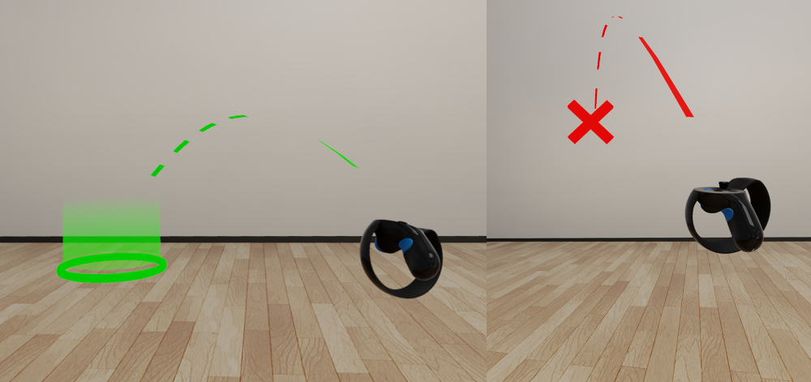

# Navigate in VR

While you have the **Level Viewport VR** active, you can move around the scene in several different ways. Each navigation method is particularly useful in different circumstances and for different purposes. Once you get to know all the movement modes, you'll learn to switch instinctively from one to another depending on where you need to move in the scene.

## Move your HMD

The movements and rotations of your head-mounted display in the physical world are tracked and replicated in the virtual space of the level. As you move your head around in the real world, your point of view in the level changes to match. This is the most intuitive and simplest way to look around.

-	As always when using VR, remember that you are limited to the space you have around you in the real world.

-	Be careful of nearby objects and wires, especially as you wave the controllers around in the air. It's easy to lose track of your spatial relationship to real-world objects as you interact with the virtual world.

## Teleport

You can teleport instantly from your current position to anywhere else in the level that you can see. This movement mode is great for reaching far-away places quickly, and is typically the main way you'll move from place to place.

Press the Teleport button on either controller. Your laser pointer is replaced by a dashed, curved line. The destination for your teleport is the point where this arc intersects an object in the scene.

-	Release the teleport button while the end of the arc is a green circle to move to that location.

-	If the end of the arc is a red X, the destination is unreachable -- typically, this means a surface that is not level enough to stand on.

>	**Note:** While editing a level in VR, you can teleport to any surface that is roughly level, regardless of whether that unit has a physics actor. This is different from the runtime teleportation behavior of the **Desktop VR** project template, in which you can only teleport to a surface if that surface is level *and* has a physics actor.

## Pan and slide

Press the trigger button on the side of either controller's grip to activate pan mode.

When you press the pan button, the controller is locked to its position in the level's world space. As you move the controller around in the real world, your viewpoint on the level slides around in virtual space to match the controller's movements.

The apparent effect is that you are grabbing the 3D space of the level and pulling yourself to a new location.

This movement mode is good for making slight changes in position that are too small to require teleportation, and for reaching points of view that you can't otherwise achieve. However, you will always keep the same facing direction in the scene when panning.

## Scale and steer

Press both pan buttons at the same time to enter scaling and steering mode.

-	Move the controllers apart to decrease your scale relative to the scene around you. This can be useful to zoom in on the fine details of intricate models.

-	Move the controllers closer together to increase your scale relative to the scene around you. This is an effective way to see the entire extents of large scenes such as buildings or city blocks, and lets you manipulate objects like you're moving miniatures around in a scale model.

-	While holding both pan buttons, you can also rotate the level on the horizontal plane by rotating the controllers with respect to each other.

You can combine these movements to change your facing direction and location in the virtual world without needing to change your physical location, in case you are limited by your surroundings or wires. For example, you can zoom out, rotate the scene, then zoom back in at a different spot.

### Scale presets

As you change scale up and down, you'll notice a tendency for the magnification level to snap to certain pre-set values:

-	`0.04`, mouse size: 1 meter in your physical space equals only 4 centimeters (1.5 inches) in the level's world space.

-	`0.5`, child size.

-	`1.0`, adult size: 1 meter in your physical space equals 1 apparent meter in the level's world space. This is the default magnification level.

-	`3.0`, T-Rex size.

-	`15`, bird's-eye view.

-	`200`, building size: 1 meter in your physical space equals 200 apparent meters in the level's world space. This setting gives you a high-level view of even very large models.

>	**Tip:** To reset the scale instantly to `1.0`, teleport anywhere in the scene.
