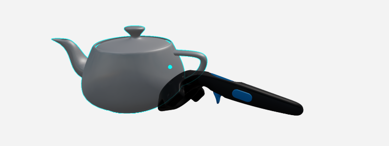

# About VR editing controls and menus

This page describes the controls and menus available to you while editing a level in VR.

## Controller buttons

Button layout for HTC Vive controllers:

Button layout for Oculus Touch controllers:

**Right-hand controller buttons:**

-	**index trigger**: selects the object or manipulator being highlighted by the laser cursor or the point cursor. See [About the selection cursors](#about-the-selection-cursors) below.

-	**grip button**: enters panning mode, which lets you drag your viewpoint around the level, or change the apparent scale of the level. See ~{ Navigate in VR }~.

-	**primary thumb button**: enters teleport mode, which lets you move instantly to another location in the level. See ~{ Navigate in VR }~.

**Left-hand controller buttons:**

-	**index trigger**: toggles multi-selection mode. While multi-selection is active, selecting an object with your laser pointer toggles its selection status, regardless of how many other items you have selected. See ~{ Work with level objects in VR }~.

-	**grip button**: enters panning mode, which lets you drag your viewpoint around the level, or change the apparent scale of the level. See ~{ Navigate in VR }~.

-	**primary thumb button**: enters teleport mode, which lets you move instantly to another location in the level. See ~{ Navigate in VR }~.

-	**secondary thumb button**: opens [the VR menu](#the-vr-menu).

>	**Tip:** If you're left-handed, you may want to switch the primary and off-hand controllers, so that you can use your left hand to select objects and your right hand to hold the menu. See the [Feedback and general settings](#feedback-and-general-settings) section below.

## About the selection cursors

Your primary controller offers two different cursors for interacting with objects in VR: a laser pointer for interacting with objects at a distance, and a "point cursor" for manipulating objects by grabbing them directly.

The laser pointer is the default selection tool. Your primary controller casts the laser out into the scene whenever it is not touching the bounding box of an object. You can use this laser to:

-	select items in [the VR menu](#the-vr-menu).
-	select objects in the level at a distance.
-	move selected objects using their transform manipulators.

However, when you bring your controller inside the bounding box of an object, the laser cursor is replaced by a small dot. This dot indicates that you can grab the object and move it around the level by simply moving your controller.

**Laser cursor color legend:**

-	 Light blue: The default color for the laser when it is at rest. When the light-blue laser is highlighting an object, you can press the right index trigger to select that object.

-	 Yellow: hovering over a selected object in the level, or interacting with an item in the VR menu.

-	 Red,  green, or  dark blue: interacting with a move, rotate, or scale manipulator for an object.

**Point cursor color legend:**

-	 Light blue: You can press the index trigger to select the highlighted object.

-	 Orange: You have objects selected and the index trigger pressed down. You can move highlighted objects around by moving the controller.

-	 Yellow: You've released the index trigger, but at least one object is still selected. If you activate multi-selection mode, you can move your controller to grab a second object, then move both objects together.

See also [Select objects](move_clone_delete_vr.html#select-objects) and [Transform selected objects](move_clone_delete_vr.html#transform-selected-objects).

## The VR menu

Press the secondary thumb button on your off-hand controller to open the main VR menu:

Aim your laser cursor at an icon to highlight it, and press the right index trigger to select.

>	**Tip:** The menu gets bigger and smaller when you move it in and out of your direct line of sight.

### Clone

Copies all level objects that you currently have selected and adds them to the scene.

### Toggle multi-selection

Activates multi-selection mode. While this option is selected, you can select multiple objects with your laser pointer without needing to press the left index trigger.

Press the left index trigger at any time to release this setting and resume the default behavior.

### Delete

Deletes any level objects that you currently have selected.

### Camera preview

If you have a camera object selected in the level, activate this menu item to see a preview rendering of the level from that camera's point of view. See [Work with a camera](move_clone_delete_vr.html#work-with-a-camera).

### Object manipulation settings

Opens the object manipulation sub-menu. The items in this sub-menu determine what kind of spatial transformations you can apply to objects that you select in the level.

>	**Move, Rotate and Scale tools**
>
>	  
>
>	These settings determine what transform manipulators are shown for objects that you select:
>
>	-	Enable the **Move** tool to see straight arrow manipulators that you can drag to move the object along a 3D axis.
>	-	Enable the **Rotate** tool to see curved arrow manipulators that you can drag to rotate the object around a 3D axis.
>	-	Enable the **Scale** tool to see squares that you can drag to change an object's extents along any 3D axis.
>
>	See [Select and move objects](move_clone_delete_vr.html#select-and-move-objects).
>
>	**Snap rotations**
>
>	  
>
>	When you have the **Rotate** tool selected, you can select one of these options to constrain the possible angles of rotation for objects that you select. This snap setting applies both when you use the laser pointer to drag a manipulator, and when you grab an object directly.
>
>	**Snap to surface**
>
>	
>
>	When this setting is enabled, objects that you move will snap to the surface of other objects in the level when they get close enough.
>
>	**Snap to grid**
>
>	
>
>	When this setting is enabled, and you use your laser pointer to move an object along a 3D axis, the edges and center of your object's bounding box will snap to the edges and center of nearby objects. This adaptive snapping can help keep the objects in your level aligned with each other.
>
>	**Snap to orientation**
>
>	
>
>	When this setting is enabled, and you move an object close to the surface of another object in the level, your selected object will automatically rotate so that its orientation matches the surface of the other object. This can help you to accurately stack and line up your objects.

### Feedback and general settings

Opens the settings sub-menu, where you can control the amount of visual and tactile feedback you receive.

>	**Toggle all descriptions**
>
>	
>
>	This setting is a master switch for the following three settings related to descriptions. When this setting is disabled, you will not see any brief descriptions for controller buttons, objects that you select in the scene, or items that you highlight in the menu. When this setting is enabled, the following three controls determine the visibility of each of those types of description.
>
>	**Toggle descriptions for controller buttons**
>
>	
>
>	When this setting is enabled, each usable button on your controllers is accompanied by a short tooltip to remind you of its function.
>
>	**Toggle descriptions for selected objects**
>
>	
>
>	When this setting is enabled, you can select an object in the scene to see a brief description that includes its name and type.
>
>	**Toggle descriptions for menu items**
>
>	
>
>	When this setting is enabled, you can hover over any item in the menu to see a brief description of that item.
>
>	**Toggle haptic feedback**
>
>	
>
>	When this setting is enabled, your VR controllers emit short vibration pulses to confirm when you highlight and select new menu items, and when you make selected objects collide with other surfaces in the scene.
>
>	**Toggle gizmos**
>
>	
>
>	When this setting is enabled, the VR rendering shows gizmos to represent level objects that are normally invisible when you run your project in the interactive engine, such as lights, trigger volumes and cameras.
>
>	Enable this setting if you want to be able to select and modify those level objects in your editing session, or disable this setting if you want to get a better idea of what the level "really" looks like without them.
>
>	**Switch primary-hand and off-hand controllers**
>
>	
>
>	When this setting is enabled, the left and right controllers switch roles:
>
>	-	the left-hand controller becomes the primary controller, hosting the laser cursor and offering the ability to select level objects.
>	-	the right-hand controller becomes the secondary controller, hosting the VR menu.

### Undo and Redo

 

Undo and re-do the last changes you made to your level while editing in VR. You can undo:

-	deleting an object.
-	cloning a new copy of an object.
-	changing an object's position, rotation or scale.
