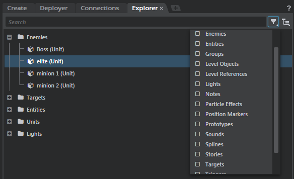

# Organize level objects in categories

You can keep the objects in your game levels organized in the **Explorer** panel by creating your own custom categories. These new categories appear in the tree view of **Explorer** view, and in the filter control in both **Explorer** view and **Layers** view.

For example, this image shows custom categories like "Enemies" and "Targets" alongside the built-in categories like "Entities", "Units", "Lights", and "Triggers".

**To create a new category:**

Categories are defined in *.object_filter* resource files in your project folder. For each new category you want to show up in your **Explorer** panel, you need to create a new text file that follows the SJSON format shown below, and give it the *.object_filter* extension.

**To re-apply a category filter**

When you create or modify a category, you do not need to restart the interactive editor to make your changes show up in the **Explorer** panel. Instead, press **F5** to refresh the resource from your project's source folder.

## The *.object_filter* resource format

The following *.object_filter* example was used to create the "Enemies" category shown above:

~~~{sjson}
category_display_name = "Enemies"
category_type_name = "enemies"
evaluation_priority = 10.0
ui_order = 0.0
is_type = """
	-- params: (level_object, engine_object)
	if level_object._unit ~= nil then
		if Unit.has_data(level_object._unit, "is_enemy") then
			return Unit.get_data(level_object._unit, "is_enemy")
		end
	end
	return false
"""
~~~

You can set the following parameters:

`category_display_name`

>	The name of the category as it will appear in the **Explorer** panel.

`category_type_name`

>	An internal name for this category type. This name must be unique across all *.object_filter* definitions used in the project, including the built-in categories in the core resources.

`evaluation_priority`

>	Specifies the priority of this filter. If an object in the level matches the filter function for more than one category, the object will be placed in the category that has the highest evaluation priority value.

`ui_order`

>	Specifies the ordering of this category in the **Explorer** tree view. The ordering is from top to bottom, so higher numbers will place the categories lower in the list. Categories with the same `ui_order` value are sorted alphabetically.
>
>	This field is optional. If you don’t specify a value, the category will be put at the end of the list and sorted alphabetically with any other categories that do not have a `ui_order` value.
>
>	Note that the categories in the filter list are always sorted purely alphabetically.

`is_type`

>	A Lua function that will be called for each object in the level, in order to determine whether or not that object should be placed in this category. Make sure that you enclose your Lua code between triple-quotes: `"""`. See the next section for details.

## Writing the filter function

Each category must contain an `is_type` function, which the editor calls for each object in the level. The job of the `is_type` function is to determine whether or not a single level object passed in by the editor should be included in this category.

The editor passes two parameters to this function:

-	`level_object`: A wrapper object that represents the game object you need to test within the level editor's Lua environment. You can use this wrapper to find out information about the game object, such as what type of object it is, or what are its coordinates in 3D space.

	These wrapper objects are not currently documented, but you can find their code in the `core/editor_slave/editor` folder. The base object definition is in `object.lua`, which is inherited by other kinds of specialized objects such as the `UnitObject` defined in `unit.lua`. See also the `LevelEditing` object in `level_editing.lua`, which provides some object management and testing utilities.

-	`engine_object`: The game object that is wrapped by the first parameter. This may be any of various kinds of objects exposed in the Lua API, such as a `stingray.Unit`, `stingray.Light`, `stingray.Camera`, and so on. Once you find out from the level object what kind of game object this parameter represents, you can use the appropriate runtime API to interact with the object.

The function must return `true` if the object passed in should be included within this category, and `false` otherwise.

### Example: filtering by script data

In the example above, the filter function returns `true` only for units that have a certain type of script data set on them:

~~~{lua}
if level_object._unit ~= nil then
	if Unit.has_data(level_object._unit, "is_enemy") then
		return Unit.get_data(level_object._unit, "is_enemy")
	end
end
return false
~~~

Using this code, you would divide your game units into categories by tagging them with different script data that identifies their object types. For example, you might set different script data values for scenery objects, props, vehicles, or characters. depending on what categories you want to set up.

You can set script data for a unit resource in the **Unit Editor**.

### Example: filtering by resource name

You can organize your objects into categories based on their resource names. For example, the following function returns `true` only for objects whose unit resources match one of a specified list of values:

~~~{lua}
local resource_names = {
	"content/models/character/character",
	"content/models/props/target"
}
if level_object._unit ~= nil then
	for _, name in pairs(resource_names) do
		if stingray.Unit.is_a(level_object._unit, name) then return true end
	end
end
~~~

### Example: filtering by unit name

If you have a well-defined scheme for assigning names to the units you spawn in the editor, you can make use of this naming scheme to organize your objects into categories. For example, the following function returns `true` only for units whose names start with the string `enemy_`:

~~~{sjson}
if level_object.name:find("^enemy_") then return true end
return false
~~~

### Example: filtering by dynamic data

You are not limited to filtering by static properties of the objects. You can also make your filters take into account dynamic aspects of the current state of the level editor.

The only catch is that if your filtering relies on data that can change over the course of editing the terrain, you will have to press **F5** to reapply the category filtering when that data changes.

For example, the following function gathers up all the objects that are currently selected in the editor. This lets the level designer add an arbitrary set of objects to the category on the fly.

~~~{sjson}
if level_object._unit ~= nil then
	if LevelEditing.selection:includes(level_object.id) then return true end
end
return false
~~~

Other uses of this technique might be to group together all objects within the camera's current frustum, or all objects that are currently hidden in the editor (in order to pull them out of other lists).

### Example: filtering by level placement

You can organize resources by their position in the 3D scene. For example, the following function includes any units that are within 10 meters of a reference position.

~~~{sjson}
reference_point = stingray.Vector3(0,0,0)
distance_threshold = 10
if level_object._unit ~= nil then
	local position = level_object:local_position()
	if stingray.Vector3.distance(reference_point, position) < distance_threshold then return true end
end
return false
~~~

In this example the reference point is the origin, but you could use other points like the viewport's camera position, a selected object, or a unit picked by the screen position of the mouse.

Any time a unit is added to the scene in that area, it will automatically be added to the category. However, if you move an existing unit into the area, you will need to press **F5** to re-apply the filter in order for the change to apply.

---
Related topics:
-	~{ About the SJSON data format }~

---
