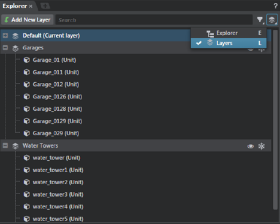

# Organize level objects in layers

Layers group level objects together, letting you quickly select, hide, or freeze them in the **Level Viewport**.

**To toggle the Layers view**

1. In the **Explorer** window, click  and select **Layers** (Hotkey: L) or **Explorer** (Hotkey: E).
