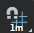
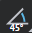

# Adjust the grid and rotation snapping options

**To adjust the grid snapping distance**

1. In the ~{ Toolbar }~, do one of the following:
 
	- Right-click , then enter a grid unit size.
	- Click and hold , then select a grid unit size from the pop-up menu that appears.
 
	The grid unit size is displayed on the **Grid Step** icon ( ) and the grid updates to reflect the new size.

**To adjust the grid snapping options**

1. In the Toolbar, click and hold .
2. In the pop-up menu that appears, select or deselect any of the following options to control snapping behavior:

	- Snap to Point: Snaps the currently selected level object to any point on another object in the level.
	- Snap to Surface: Snaps the currently selected level object to any surface on another object in the level.
	- Absolute: Snaps level objects using absolute coordinates. Absolute snapping always snaps objects to the nearest grid intersection regardless of the object's original position.
	- Relative: Snaps level objects using relative coordinates. For example, when an object is not snapped to the absolute grid, but is positioned in between grid lines, relative snapping moves the object the snap distance while using the object's original position as a starting point.

**To adjust the rotation snapping angle**

1. In the Toolbar, do one of the following:
 
	- Right-click , then enter a rotation angle increment in degrees.
	- Click and hold , then select a rotation angle increment from the pop-up menu that appears.
	The rotation angle increment is displayed on the **Rotation Step** icon ( ).

---
Related topics:
-	~{Enable or disable snapping}~
---
