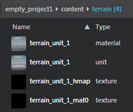

# Terrain tool

You can use the interactive editor's terrain tool to create and edit *terrains* -- large-scale ground surfaces that have height variations, blended surface textures, and even scattered units that simulate undergrowth and vegetation. You can create terrains by sculpting them directly in the interactive editor, or by importing textures that you create in other applications.

Terrains are internally represented as a unit and two textures. One of the textures is a height map: a single channel texture that describes the height of the terrain.

The other texture is a material map, which you can use to texturize the terrain. This texture is a normal 4 channel 2D texture with channels mapped to the textures that you want in-game, letting you paint different textures onto the terrain by painting on a material map channel.

> **NOTE:** Terrains are currently supported only when running your project on Windows, PlayStation 4, or Xbox One. They are not supported on Android or iOS.

---
Tags:
- Landscape
---
