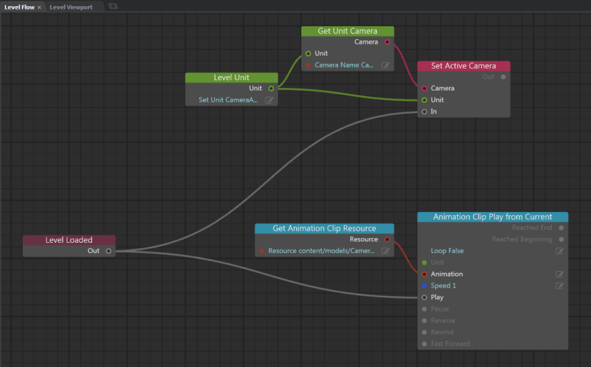

# Import an animated camera from Maya

1. In Maya, export the animated camera as an FBX file.

2. In the interactive editor, import the FBX file as a unit with a skeleton and an animation clip:

	- Use the **Asset Browser** to navigate to the folder where you want to import the camera.
	- Click **Import**.
	- In the **Import FBX** options, select **New or update skeleton** in **Skeleton** and enter a name for the skeleton in **Skeleton Name**,and ensure **Animation** and **Import clips** are on.

3. Drag the camera unit from the **Asset Browser** into your level.

4. In the **Property Editor**, set the camera translation values to 0, 0, 0.
	(This is so your animation will play relative to the origin and register properly to existing objects in your level.)

5. Open the ~{ Level Flow Editor }~ and create Flow nodes to set the camera as the active camera and set the animation clip to start playing back.

	

6. Test the level. (Click the green Play button.)

	This launches your level (in the **Test Level** window) so that you're looking through the new camera as it plays back its animation.

---
Related topics:

- ~{ Interop with Maya, Maya LT, or 3ds Max }~

Tags:
- previz

---
