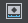

# Создавайте простые анимации с помощью **Story Editor**

1. Выберите unit (или units) которые хотите анимировать и щелкните  в ~{ Story Editor }~. Нажмите *Yes* когда будет предложено указать, хотите ли вы добавить юниты в историю.

	Это добавляет новый story и новый unit track в tree view area.

	По умолчанию unit track позволяет получить доступ к свойствам преобразования объекта для анимации. Щелкните правой кнопкой мыши, чтобы выбрать и добавить дополнительные свойства в unit track, включая свойства материала.

2. Нажмите  чтобы включить редактирование юнита.

3. Скраб к кадру или времени, которое вы хотите в **Story Editor** timeline, манипулируйте объектом в **Level Viewport**, затем нажмите S или click   чтобы задать ключевой кадр.

4. После того, как вы установили несколько ключевых кадров, используйте элементы управления воспроизведением в **Story Editor** для просмотра анимации в **Level Viewport**.

5. Редактируйте ключи по мере необходимости, используя либо просмотр редактирования кривой, либо вид редактирования ключей. (Click  or  для переключения между панелями просмотра.)

	>	Скопируйте ключ (или несколько ключей) и вставить дорожку (или несколько дорожек) используя клавиши Ctrl + C, Ctrl + X, Ctrl + V или контекстное меню правой кнопкой мыши. Используйте ползунок времени для перетаскивания в позицию для вставки дорожки. Ключи вставляются на несколько дорожек в порядке выбранных дорожек.

Когда вы закончите редактирование анимации для unit, нажмите снова  чтобы отключить **Story Editor** и вернитесь к редактированию своего уровня.

## Важные замечания о работе с **Story Editor**

- Вы по-прежнему можете выбирать, перемещать, удалять или изменять значения ключей, когда **Story Editor** не является Live.
- когда **Story Editor** в live, изменение положения устройства на уровне не даст эффекта. Чтобы снова отредактировать положение устройства на уровне, выйдите из Story mode. (Кликните LIVE для включения и выключения режима.)
- Когда вы анимируете units в **Story Editor**, анимация воспроизводится только в **Level Viewport**, он не может воспроизводиться на подключенных устройствах.
- При анимации свойства юнита или сущности, редактирование значений в **Property Editor** не влияет на ключи в **Story Editor**. При анимации unit transform (position, rotation, scale), вы можете использовать **Property Editor** для редактирования значений animation.

---
Related topics:
-	~{ Story Editor }~
-	~{ Story Editor hotkeys }~
-	'~{ Example workflow: Trigger a door opening }~'
---
