#Story Editor

- **Window > Story Editor**

**Story Editor** это инструмент для создания простых анимаций для объектов/юнитов и сущностей на уровне. Вы можете добавлять units и entities в Story и анимироватьт их трансформации и другие параметры используя keyframe анимацию. (в Story нельзя использовать animation clips .) Смотрите также ~{ Создавайте простые анимации с помощью Story Editor }~.

Этот редактор состоит из следующих основных областей:

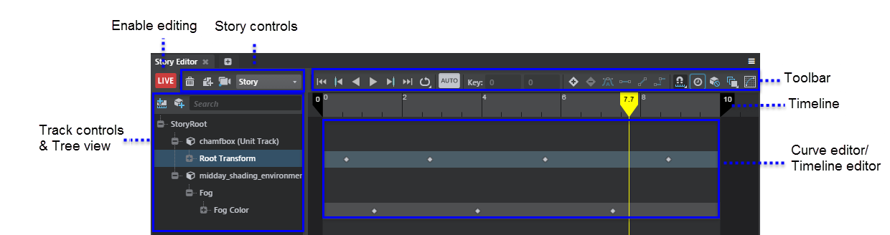

Обратитесь к разделам ниже, чтобы узнать больше о каждой области.

##LIVE button

Нажмите, чтобы переключить Story mode. Когда включено,  **Story Editor** будет "live" поэтому вы можете начать добавлять анимацию ключевого кадра на выбранные объекты.

  > **Important:** Когда включен режим Story, изменение положения объекта на уровне не будет работать. Чтобы снова отредактировать позицию устройства на уровне, выйдите из Story mode. (Нажмите LIVE для включения и выключения режима.)

Вы по-прежнему можете выбирать, перемещать, удалять или изменять значения ключей, когда **Story Editor** не live.

  > **Note:** Когда вы анимируете units в **Story Editor**, анимация воспроизводится только в **Level Viewport**, он не может воспроизводиться на подключенных устройствах.

##Story controls

Нажмите  добавить новый Story в редактор. Если вы выберете unit или entity перед щелчком , редактор автоматически добавляет unit или entity на новый уровень объекта трека в истории.

При работе над несколькими историями в пределах уровня, используйте выпадающий список Current Story для переключения между ними.

##Toolbar

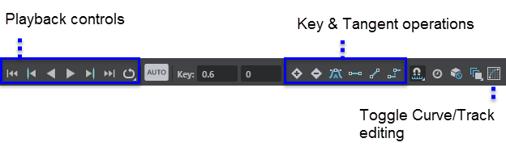

Панель инструментов **Story Editor** включает:

| Контрол |  Описание |
|----------| -------------|
| **Playback Controls** 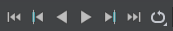 | Используйте элементы управления воспроизведением для просмотра анимаций в **Level Viewport**, при редактировании unit анимации в **Story Editor**. используйте  для воспроизведения анимации в прямом направлении и  играть в обратном направлении.  Чтобы изменить [playback mode](#playback), выделите 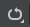, right-click to select **Loop** or **Ping Pong**.  |
| **Snap** 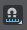 | Включает привязку кадров или секунд на временной шкале.|
| **Autokey**  | Когда включено, после того, как вы один раз запустите ключевой кадр, объект автоматически будет разбит на ключевые кадры каждый раз, когда вы будете манипулировать им в **Level Viewport**. |
| **Time mode** 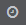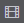 | Переключение временной шкалы для отображения секунд или кадров. |
| **Edit key fields** 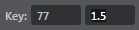 | Вручную введите время и значение для выбранного ключевого кадра.|
| **Key & Tangent options** 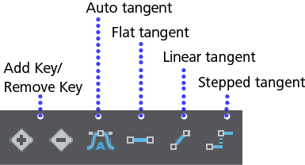 | Используйте параметры ключа и касания, чтобы добавить или удалить ключевые кадры и касательные режимы. |
| **Story Selection mask** 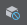 | Выбор масок, чтобы вы могли выбрать только объекты в текущей истории.|
| **Onion skinning**  | Переключает отображение ореолов на выбранные единицы. Щелкните правой кнопкой мыши, чтобы указать, следует ли указывать **Все**, или только **выделенные юниты**. Для доступа к дополнительным **Onion Skinning Settings** (включая цвет)  панели **Properties** , выберите `StoryRoot` в **Story Editor** tree view, или в панели main **Explorer** . |
| **Capture Frames Tool**  |Открывает ~{ Capture Frames Tool }~.  Story должен быть выбран для начала захвата кадров. See also ~{ Capture frames to disk }~.  **Note:**  **Story Editor** не должен быть в режиме "Live" для захвата кадров. |
| **Curve editor/Key editor** 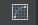 | Используйте значок кривой на панели инструментов, чтобы переключаться между различными видами редактирования в этой области.  Режим редактирования кривых: 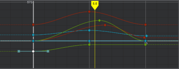   **Tip:** Выберите ключи на одной кривой и введите значение в поле редактирования на панели инструментов, чтобы редактировать сразу несколько ключей.   Режим редактирования ключей: 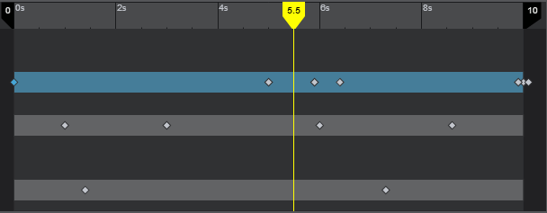 |

**Управление воспроизведением истории**

Story Editorпредлагает следующие режимы воспроизведения, которые контролируют, что происходит, когда история достигает конца своего диапазона воспроизведения.

-  **None  :** Анимация останавливается в конце диапазона шкалы времени.
- **Loop 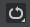:**  Анимация перезапускается с самого начала каждый раз, когда она достигает конца диапазона воспроизведения.
- **Ping Pong :** Анимация переключает направление воспроизведения каждый раз, когда достигает одного конца диапазона воспроизведения. Он воспроизводит вперед, пока не достигнет конца диапазона воспроизведения, затем воспроизводит анимацию в обратном направлении до тех пор, пока она не достигнет начала диапазона воспроизведения, и переключит направление на повторение цикла.

По умолчанию, unit анимации воспроизводятся в режиме **None**.

Для unit track,  **Pre Infinite** и **Post Infinite** настройки (щелкните правой кнопкой мыши индивидуальное преобразование юнита или другие юниты) определить поведение анимационной кривой перед первым ключом и после последнего ключа дорожки в активном диапазоне временной шкалы. Вы можете использовать эти настройки, чтобы анимация играла дольше в режиме **None**, и управлять тем, как кривые обрабатываются вне диапазона воспроизведения. Чтобы установить диапазон воспроизведения,

- Перетащите черные ползунки на таймлайне Story Editor на новое время.
- Измените значение диапазона цикла истории, используя `stingray.StoryTeller.set_loop_range()` функцию Lua или узел **Level > Level Story** во Flow.
- Выделите `StoryRoot` в Story Editor tree view или панели **Explorer** и измените **Story Settings** start и end time.

##Timeline

- Использовать значок привязки  для включения привязки к секундам или кадрам.

- Используйте значок часов  для переключения между показом секунд или кадров на временной шкале.

##Track options & Tree view

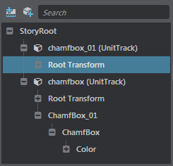

Используйте древовидное представление для просмотра и выбора сюжетов, дорожек и свойств для ключевого кадра. Древовидная структура включает небольшую панель инструментов с панелью поиска и следующие параметры для добавления дорожек:

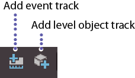

**Add level object track**

использование level object tracks для организации анимации ключевого кадра для каждого unit или entity добавленных к story. Unit track автоматически создается, если вы выберете объект перед нажатием .
 
Дорожка entity автоматически создается, если вы выберите entity перед нажатием .

Right-click level object tracks для добавления дополнительных свойств для анимации, включая свойства материала объекта.

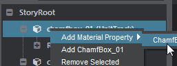

**Добавить дорожку событий**

Добавить дорожки событий и установить ключи, которые вы хотите открыть в **Level Flow** Editor. Вы можете использовать rk.xb на дорожках событий, чтобы вызвать что-либо в потоке уровня. (Воспроизведение звука, запуск эффекта частицы, настройка переключателя камеры и т. Д..)

Чтобы получить доступ к событию в Flow после создания key в Story, добавьте узел **Level > Level Story** , затем нажмите `Story`.

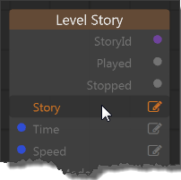

В появившемся всплывающем окне выберите Story содержащий дорожку событий, которую вы хотите.

Это добавляет параметры дорожки событий к Story node, поэтому вы можете подключить вывод события, чтобы вызвать что-то еще.

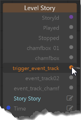

---
Related topics:
-	~{ Story Editor hotkeys }~
-	~{ Create simple animations with the Story Editor }~
---
