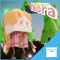
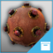

# Создание Геймплэя

В {{ProductName}}, вы можете настроить interactive gameplay используя визуальное программирование Flow, и скриптинг на Lua. Статьи этого раздела познакомят вас с обоими.

>  Прекрасный способ познакомиться с созданием интерактивности это разобрать пару рабочих проектов. Они построены в основном на Flow, поэтому они демонстрируют интерактивные приложения, которые вы можете создать без необходимости писать тонны собственного кода.

<table class="not-ruled"><tr><td>

</td><td>
Want to play around with a shooter game implemented entirely in Flow? Open the Top-Down Space Shooter project from the **Online Projects** tab of the **Project Manager**, or [download the project here](https://gamedev.autodesk.com/stingray/plugins/space_shooter_gamekit).
</td></tr>
<tr><td>

</td><td>
Capture the stars while you leap to new levels in this side-scrolling platformer! Open the Nora project from the **Online Projects** tab of the **Project Manager**, or [download the project here](https://gamedev.autodesk.com/stingray/plugins/nora_gamekit).
</td></tr>
<tr><td>

</td><td>
The Gears game shows off physics-based gameplay with a musical touch. Open it from the **Online Projects** tab of the **Project Manager**, or [download the project here](https://gamedev.autodesk.com/stingray/plugins/gears_gamekit).
</td></tr>
</table>
