# Create and import a ragdoll

This workflow describes how to build a ragdoll using the PhysX plug-in in Maya, then export to {{ProductName}}. The second part of this tutorial still applies if you build the ragdoll in another application.

##Task overview

1. [Get ready in Maya.](#step1)
2. [Create a rigid body for the hips.](#step2)
3. [Add the torso.](#step3)
4. [Create remaining rigid bodies.](#step4)
5. [Test and export.](#step5)
6. [Import to {{ProductName}}.](#step6)
7. [Control the ragdoll in {{ProductName}}.](#step7)

See also:

[Troubleshoot PhysX errors](#troubleshootphysx)

[Partial ragdoll example](#partial)

## Step 1. Get ready in Maya 

1. Download and install the PhysX plugin for Maya. See ~{ Install the PhysX plug-in for your DCC tool }~.

2. In Maya, load the plug-in using the **Plug-in Manager** (**Windows > Settings/Preferences > Plug-in Manager**). The PhysX menu displays in the main menu bar when the plug-in is loaded.

3. Change the **Working Units** preference in Maya to **meter**.

	(This works better with the  physics engine.)

	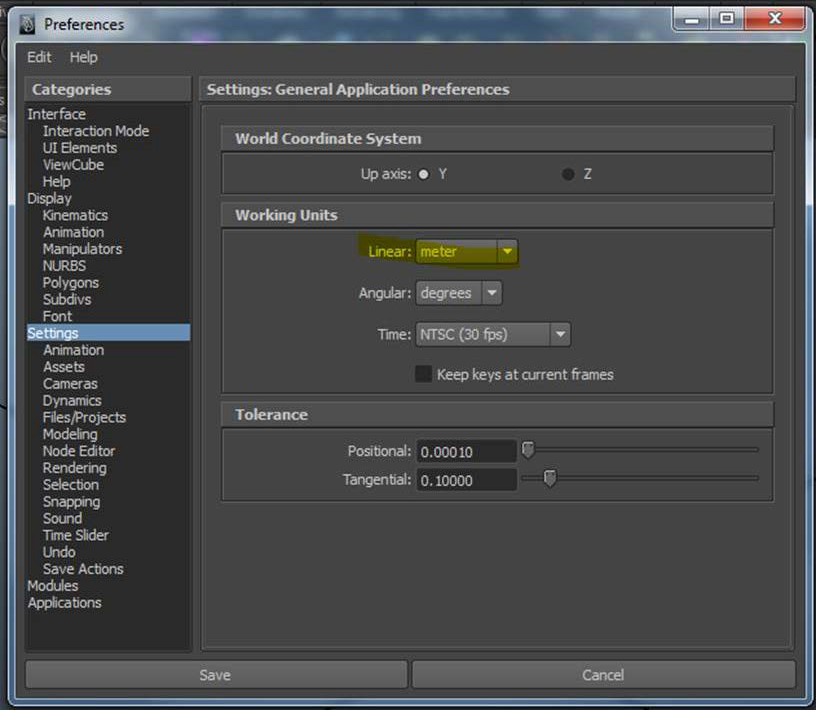

4. Extend the time range in the scene.

	This gives you room to test the physics later.

	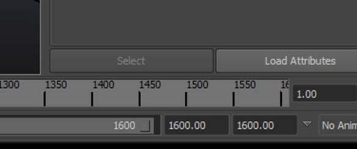

*  *  *
##Step 2. Create a rigid body for the hips 

The hips/pelvis is the first bone where you need to add a rigid body.

1. Select the hips joint and create a dynamic rigid body by selecting **PhysX > Rigid Bodies**.

	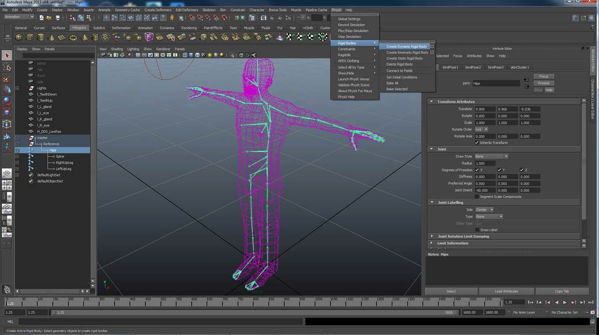

	By default, PhysX creates a shape for each joint attached to the current one.

	

2. Delete the extra joints and keep only one, since you need only simple physics.

	

3. Adjust the shape of the rigid body to make it closer to the geometry as follows:

	- Select the shape in the **Outliner**, then find the shape node attributes in the **Attribute Editor**.

		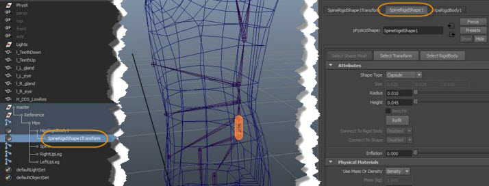

	- Select a **Shape Type** that suits your purposes but *avoid* **Convex Hull** and **Triangle Mesh**.

		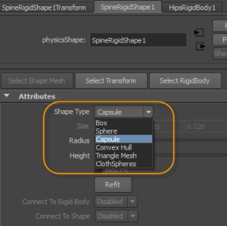

	- Tune the shape size to fit your geometry. (In this example, make it bigger.)

	- You can also offset the shape using the shape transform, and make it closer to the body center.

		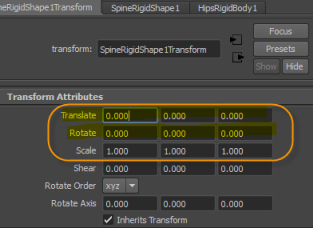

	Proceed until you are happy with the shape and how it fits the skin geometry.

	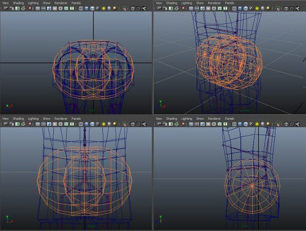

4. Select **PhysX > Play/Stop Simulation**.

	The character falls onto the floor.

5. Select **PhysX > Rewind Simulation** to resume editing.

6. Select the hips rigid body and use the **Attribute Editor** to switch its **Simulation Type** to **Kinematic**.

	This is to prevent it from moving as you work on other rigid bodies.

	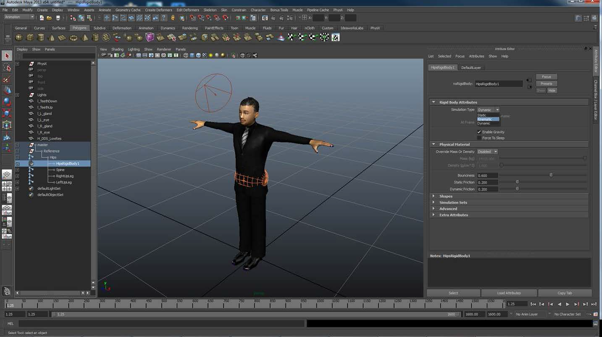

*  *  *
##Step 3. Add the torso 

1. Select a spine bone, and add a rigid body to it.

	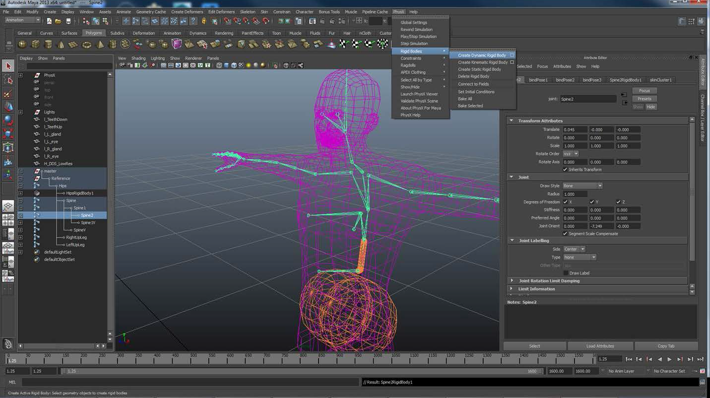

2. Delete the extra shapes created (keeping only one), and position it so that it represents the torso geometry. For example:

	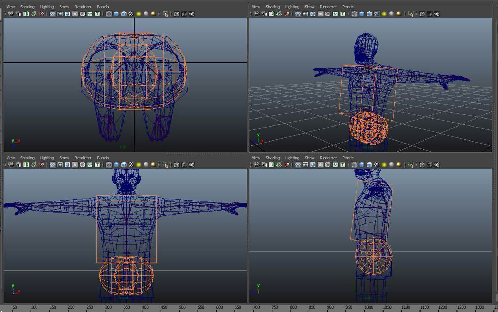

3. (Optional) If you select **Physx > Play Simulation** now, the character gets split in two.

	The hips section doesn't move  (as expected) because its **Simulation Type** is set to **Kinematic**, and the torso falls to the ground.

	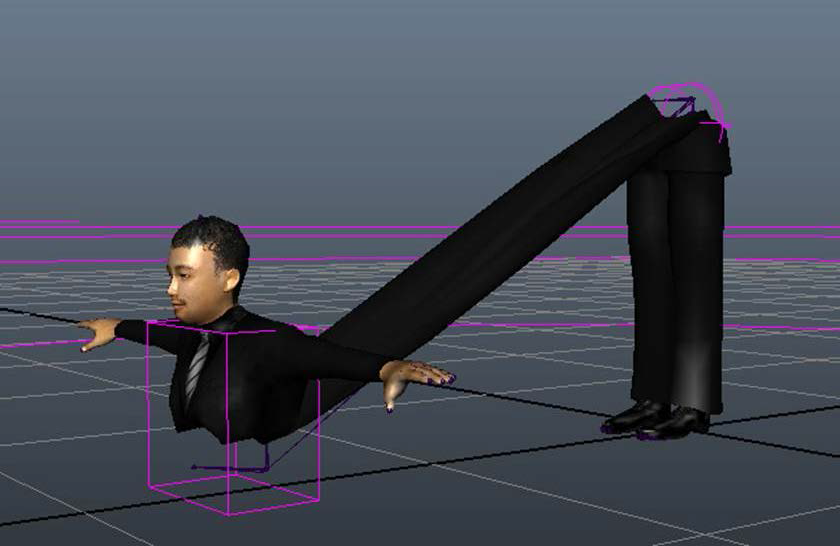

	Next, we need a constraint between the two rigid bodies.

3. Select the hips rigid body, then Ctrl+click to select the torso rigid body.

	(Order of selection is important. You want the torso constrained to the hips, not the other way around.)

4. Select **PhysX > Constraints > Create constraint**.

	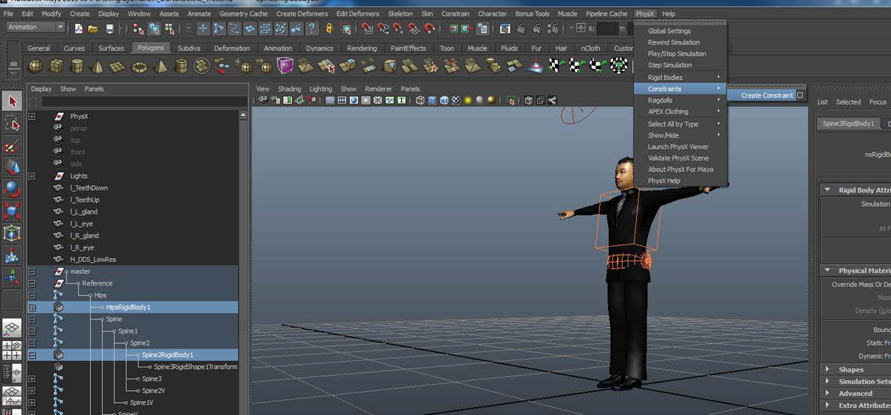

5. Select the constraint in the **Outliner**, then increase the **Radius Scale** in the **Attribute Editor**.

	In the scene view, you can see a white representation of the constraint limit.

	

4. Launch the physics simulation (**Physx > Play Simulation**) to test the constraint.

	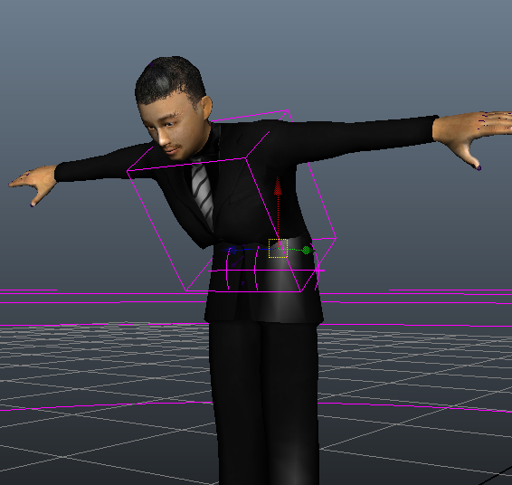

	You should see your torso being constrained to the hips, but you likely want to tune the constraint.

5. Position it so that it makes sense from a physical standpoint (probably somewhere between the two connected bodies, or in general at the location of the joint (knee, ankle, arm).

	

6. Adjust the limits of the selected joint, starting with the **Swing** attributes.

	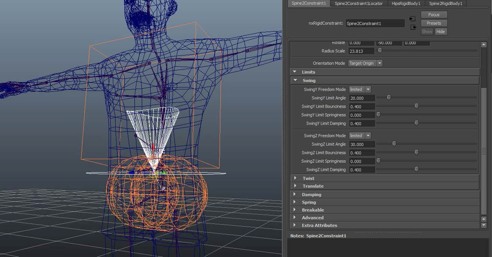

7. For the Twist attributes, in most cases we recommend setting **Twist Freedom Mode** to **Locked** for your first ragdoll version.

	You can experiment with different twist settings after you have the first version working.

8. Play the simulation, stop to tweak the limits, and repeat until you're satisfied with the results.

	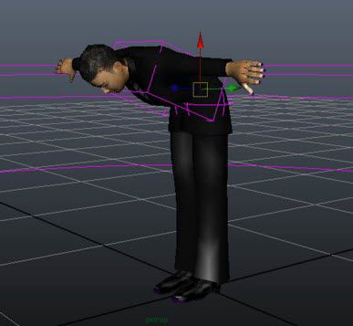

9. Select the torso rigid body and set **Simulation Type** to **Kinematic**.

	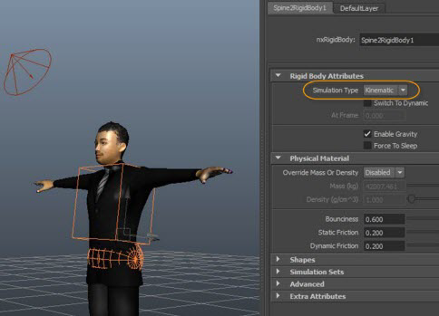

*  *  *

##Step 4. Create remaining rigid bodies 

Continue on using the same process as above, moving higher in the skeleton hierarchy with additional spine joints, head, arms and legs.

##Troubleshoot PhysX errors 

In some cases, you may see errors that indicate PhysX can't create a rigid body. For example:

~~~{nohighlight}
    ==============in nxPerformDynamics, cmd = nxRigidBody -active -m 1 -den 1 -omd 0 -adp 0 -dp 0 -sf 0.2 -df 0.2 -b 0.6 -iv 0 0 0 -iav 0 0 0
	There an existing rigid body: |master|Reference|Hips|HipsRigidBody1. Command will not be executed.
	If mesh is in a group, use rigidbody to add a physics shape.
~~~

This error can occur when you try to create a rigid body for a joint that is higher in the character hierarchy before creating one for a joint that is lower. (For example, creating one for the hips before you create one for the spine.)

To workaround this issue, create the rigid body that is lower in the hierarchy first, then create one for the joint that is higher.

*  *  *

##Step 5. Test and export 

Once you're happy with each rigid body and constraint individually, you can prepare to export to {{ProductName}}.

1. Select each rigid body and set the **Simulation Type** back to **Dynamic**.

	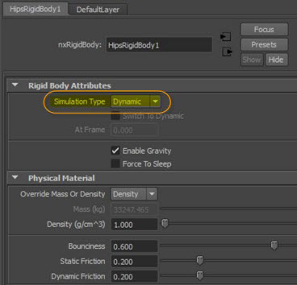

2. Play the simulation (**Physx > Play Simulation**).

	The character should collapse quite nicely.

	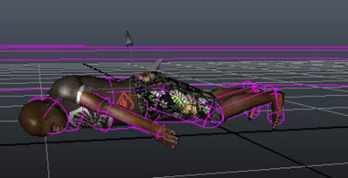

3. Select **File > Export All** > [ ] to open the FBX Export Options, and click **Edit preset**.

	The **Edit export preset** options display, which let you change the FBX options in the exported file.

4. In the left-hand panel, scroll down to the Advanced Options, **UNITS** heading. Select and right-click **File units converted to** and select **Enable**.

5. Once enabled, set **File units converted to** to **Centimeters**.

6. Save the preset, then click **Ok**, and **Close**.

7. Back in the export options, choose the `APEX/PhysX` file format.

8. In the **File Type Specific** export options, set **Asset File Format** to **APX** to export as XML.

	

9. Navigate to your {{ProductName}} project directory and save the ragdoll file *with the same name*, and *in the same location* as an existing character unit file in your project.

	For example, if your character unit is Guy.unit, name the physics file Guy.xml.

*  *  *

##Step 6. Import to {{ProductName}} 

1. In the interactive editor's **Asset Browser**, right-click the character unit and select **Re-import**.

	The Physx file you saved in the previous steps displays next to your unit file.

2. Double-click the character unit to launch the **Unit Editor**.

	All the rigid bodies from your PhysX scene are listed on the left.

	

3. Select the groundPlane object (which is added by PhysX on export), and disable it using the Properties panel. (Turn off **Enabled** option.)

4. Place the character unit in the level, then press Play to watch the character collapse.

	

*  *  *

##Step 7. Control the ragdoll in {{ProductName}} 

You probably do not want to activate the ragdoll as soon as the unit is spawned, so let's disable the rigid bodies.

1. In the **Unit Editor**, select each rigid body and turn off the **Enabled** option in the **Properties** panel.

	

2. In the **Asset Browser**, right-click the unit and select **Create Animation Controller**.

	

3. In the **Anim Controller** editor, right-click **Ragdolls** and select **Add New Ragdoll** to define the ragdoll for this unit.

	

4. In the Ragdoll Bones properties, click the blue arrows to move each rigid body into the category you want. (By default, all are defined as **Dynamic**.)

	- **Ignored** (not active and not present in the scene)

	- **Dynamic** (physically driven)

	- **Kinematic** (animated)

	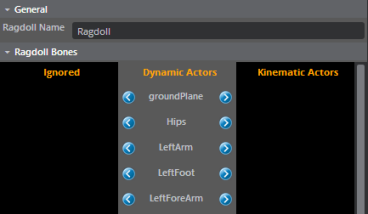

5. Select the `groundPlane` and move it to **Ignored**.

	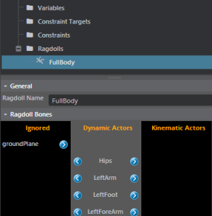

6. Right-click **Layers** and select **Add Layer**, add a regular animation state (select layer, right-click, **Add New State > Clip State**) and then select the regular animation state for the layer in the **General** settings.

	

7. Right-click the layer and select  Add New State > Add Ragdoll state, then in General settings specify the ragdoll definition you created earlier.

	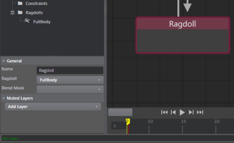

8. Add events and transition to go in and out of the ragdoll state.

	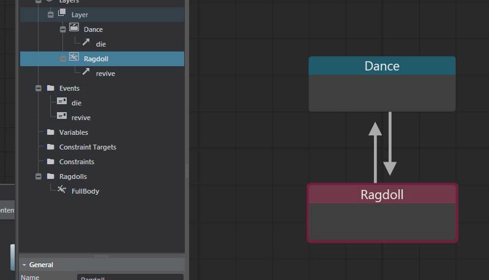

	See also ~{ Set up an animation controller }~.

9. Save the animation controller and compile.

	You can now turn the ragdoll on and off as required.

	

	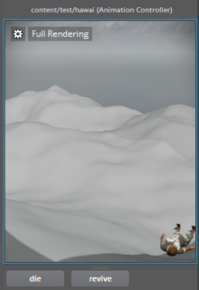

*  *  *

## Partial ragdoll example: Control the ragdoll in {{ProductName}} 

Partial ragdolls let you create limbs driven by physics, yet drive the rest of the body with animation. This example shows how to activate the ragdoll on only the left arm.

1. In the **Skeleton Editor**, create a BlendMask to isolate the left arm (for example).

	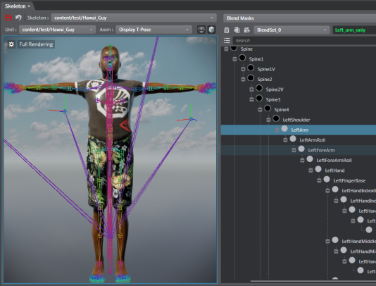

2. In the **Anim Controller** editor, create a ragdoll definition (**Ragdolls > Add New Ragdoll**) so that:

	- Left arm is a **Dynamic** Actor (uses physics)

	- Spine4 is a **Kinematic** Actor (Mandatory because left arm is attached to spine4. If not, the arm will fall on ground.)

	- All others bodies are **Ignored**

4. In the **Anim Controller** editor, create a layer for just the partial ragdoll, and give it a default empty state (right-click the new layer, select **Add New State > Empty State**).

	**Important:** Partial ragdolls require a dedicated layer.

5. Add a ragdoll state to transition to.

7. Specify the blend mask and the ragdoll definition:

	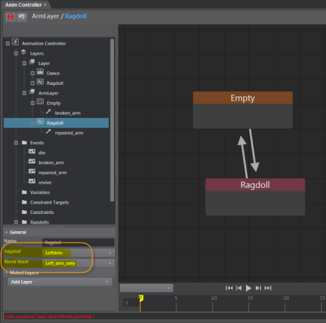

	Now, we can activate the ragdoll only on the left arm.

	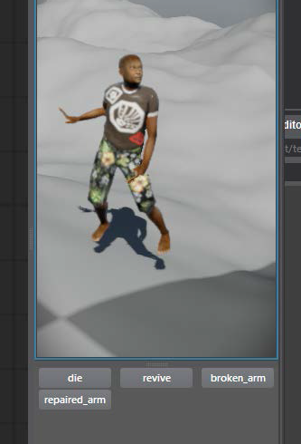

---
Related topics:

- ~{ Ragdolls }~

---
