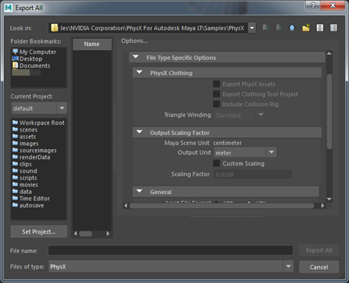

# Install the PhysX plug-in for your DCC tool

Included with your {{ProductName}} install, you'll find the NVIDIA PhysX plug-ins for Maya and Maya LT. For the latest {{ProductName}}, the PhysX plug-in version is now 3.3.21117.04582, and the PhysX library/SDK used is 3.3.4.

When installed and loaded, the PhysX plug-in adds a PhysX menu to the main menu bar in your DCC tool, giving you easy access to tools and documentation for creating PhysX ragdolls, rigid bodies, and constraints.

To install the PhysX plug-in for your DCC tool:

1. Double-click the `NVIDIA_PhysX_For_<Product>_<Version>.msi` located here within your {{ProductName}} install directory: `\Program Files\Autodesk\{{SR_DOC_SHORT_NAME}}\<*version*>\extras`

2. Follow the instructions in the NVIDIA installer.

**Note: **In the Maya or Maya LT Help, you can find more information in the topic *Enable Stingray and PhysX plug-ins*.

**Note:** Get the PhysX plug-ins for older versions of Maya from the [PhysX Plugins Download]( http://www.autodesk.com/physx-plugins-download) page.

## Setting the Unit scale for PhysX export from Maya or Maya LT

When exporting PhysX data from Maya or Maya LT to {{ProductName}}, ensure you specify the correct unit scaling for export. {{ProductName}} requires the data in meters.

You’ll find that the scaling for exported PhysX data is handled in **File > Export All (or Export Selected) > Output Scaling Factor**. Depending on the conversion units selected in the **Output Unit**, the **Scaling Factor** displays the scale factor for the exported units. To manually add the scale factor, enable the **Custom Scaling**. The **Output Unit** is set to meter by default.

This ensures the correct correlation between meshes, PhysX actors, and global-anchored joints in {{ProductName}} with the unit or coordinate system you use in Maya, and the unit you set for your FBX scene export.

Note that the **Axis Orientation** is also an important consideration during export when using PhysX.  If any of the PhysX data contains any globally expressed position (such as initial velocities, or free-anchor joints) these cause difficulties when simulated in the interactive engine. To avoid issues, export the asset in Z-Up.  If your PhysX setup does not contain any of these, you can export in Y-Up or Z-Up. For example, simple meshes without PhysX constraints and Ragdolls export correctly with any coordinate system.

## Conversion for units of mass

{{ProductName}} uses SI base units, so mass values are in kg, densities are in kg/m3, and the default density value (water) is 1000.

PhysX actors created with the NVidia PhysX plug-in for your DCC tool and exported to {{ProductName}} use grams as the base weight unit. In order to align with the units of mass expected in the interactive engine, these actors are converted to kg at runtime.
