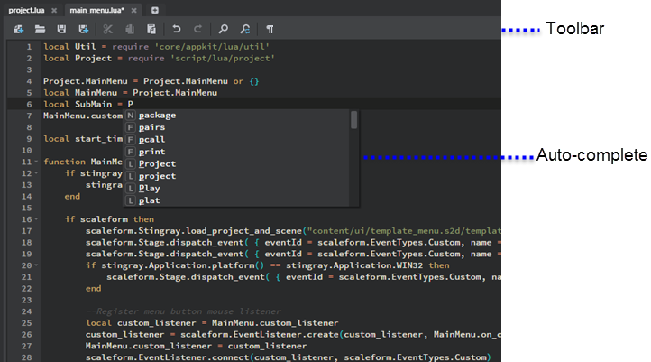
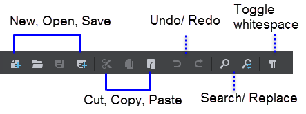

# Using the Script Editor

- **Window > Script Editor**

The **Script Editor** helps you create and edit Lua scripts for your project in the interactive editor.

You can also open and edit other kinds of text files in the **Script Editor**, including *.ini* files, *.package* files, and other kinds of data resources that use the SJSON format like *.shading_environment_mapping*, *.component*,*.render_config*,*.physics_properties*, *.type* files.

## Script Editor toolbar

## Writing code in the editor

| Task overview |
| ------------- | ------------- |
| **To open an existing script**  | Click the **Open** icon , then browse to select a .lua script file.|
| **To save a script**  | Click the **Save As** icon  to save the script with a new name. Use this when you've opened an existing script to use as a template, but don't want to overwrite the original. You can also click the Save icon  in each document tab to save as you work.|
| **To create a new, blank script**  | Click the **New** icon . The **Script Editor** clears the current script and replaces it with a blank script.  |
| **To view context-sensitive help ** | Hover over elements in the script. To get detailed help on an object or function from the Lua API, right-click and select **API Documentation**.|
| **For all basic operations  ** | You'll find that standard hotkeys apply in the **Script Editor** for most basic operational tasks such as undo/redo, cut, copy, paste, select all, find on the page, and so on. (Ctrl+C and Ctrl+V to copy and paste, for example). You can also right click to select some of these options from a pop-up menu.|

### Auto-completion

The **Script Editor** integrates both Lua documentation and Lua command auto-completion so that as you type, dynamic tooltips display reference information, as well as auto-complete suggestions.

|  Auto-complete hotkeys    |
|-----------------------------|-----------------|
| Manually pop up suggestions | Ctrl + Spacebar |
| Close                       | Esc             |
| Accept suggestion           | Tab  or Enter   |

> **Tip:** To send single line Lua scripts or predefined commands to a running instance of the engine, you can use the ~{ Status bar }~.
