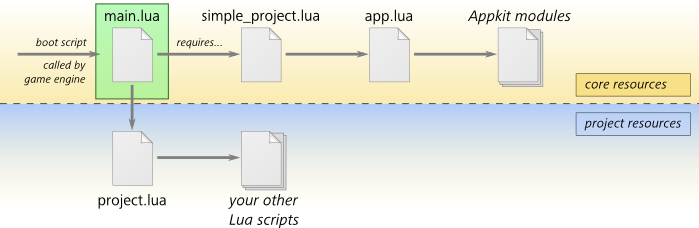
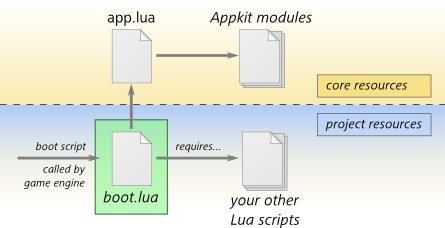

# Understanding the Appkit structure

The heart of the Appkit is the `core/appkit/lua/app.lua` file. This file defines an `Appkit` object, which provides services for managing game worlds, levels, and other kinds of utility objects.

This page compares the two principal ways of getting your game set up to use the Appkit.

## Using the `SimpleProject` helper

The template projects are all set up with the following Lua structure:

Use this setup if you want to minimize the amount of Lua code you need to write in order to get your project working.

In this scenario, access to the `Appkit` is managed through a helper `SimpleProject` object defined in `core/appkit/lua/simple_project.lua`. This helper takes care of everything involved in using the Appkit's services for managing worlds and levels. Although the `SimpleProject` wraps most Appkit usage for you, you can customize it yourself in several ways.

When the game engine starts up, it loads the `core/appkit/lua/main.lua` file as its boot script. This script brings in the `SimpleProject`, and it also looks for a script file inside your project directory at `scripts/lua/project.lua`. You use this file as your entry point for customizing the `SimpleProject` and hooking in other custom Lua code that you want to run in your game.

You can also use functions that it exposes in order to change levels from your Lua code.

See ~{ Using the SimpleProject }~.

### Requirements

If you're starting with a template project, the following tasks are already done for you. To set up a new, minimal project to use the Appkit through the `SimpleProject`, you need to:

1.	Set up the `main.lua` script as your project's boot script.

	Edit the `settings.ini` file at the root of your project, and set the `boot_script` key to `core/appkit/lua/main`.

2.	Create a new script file in your project folder, and name it `script/lua/project.lua`.

	At a bare minimum, your `script/lua/project.lua` file must set the `SimpleProject.config.standalone_init_level_name` variable to the resource name of the first level you want your project to load at startup. For example:

	~~~{lua}
	SimpleProject.config.standalone_init_level_name = "content/levels/splash_screen"
	~~~

	You can do additional customization for your project in this Lua file if desired. See ~{ Using the SimpleProject }~.

3.	Make sure that your boot package contains all the resources in the `core/appkit` folder, as well as your `script/lua/project.lua` file and any other Lua files your `project.lua` requires.

	See also ~{ About the boot package }~.

## Using the Appkit directly

If you want to use the services provided by the Appkit without using the default `SimpleProject` object, you can do so as follows:

You set up your game with a custom boot script. This boot script loads the `core/appkit/lua/app.lua` file, as well as any other custom Lua modules you want to run. In this scenario, you are fully responsible for setting up the Appkit and using the services it provides.

Use this setup if you are comfortable with developing with Lua, and if you want to completely rewrite the way the `SimpleProject` handles things like level loading. Be aware that you will need to re-implement yourself most of what the `SimpleProject` does, such as handling the Test Level event in the interactive editor, creating and destroying game worlds, or managing level transitions. See ~{ Managing worlds, levels and cameras through the Appkit }~ for an introduction to some of these tasks, and for a working sample of a boot script that loads and uses the Appkit directly.

See also ~{ Starting Lua from scratch: using a custom boot script }~ for details on the basic requirements for a custom boot script.

### Requirements

To set up a project to use the Appkit directly, you need to:

1.	Set up a custom Lua script in your project's folder as your boot script.

	Edit the `settings.ini` file at the root of your project, and set the `boot_script` key to your script's resource name.

2.	In your boot script (or in another script required by your boot script), require the `core/appkit/lua/app.lua` file.

3.	Your boot script needs to call certain functions of the `Appkit` object:

	-	You must initialize the Appkit by calling the `Appkit.setup_application()` function, typically in your global `init()` function.

	-	In addition, your boot script must implement the global `update()`, `render()` and `shutdown()` functions called by the engine. Your implementations must call functions of the `Appkit` object with the same names and parameters. For example, the global `update(dt)` function you define must at some point call `Appkit.update(dt)`.

	See also the boot script example under ~{ Managing worlds, levels and cameras through the Appkit }~.

4.	Make sure that your boot package contains all the resources in the `core/appkit` folder, as well as your custom boot script and any other Lua files your boot script requires.

	See also ~{ About the boot package }~.
