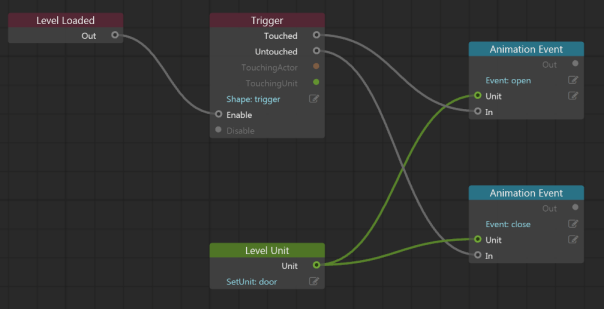

# Visual programming using Flow

Flow is the visual programming system built in to Stingray. With node-based Flow tools, you can author gameplay logic to determine all the interactions possible in your game world.  Using Flow, you can set up mission scripts, trigger effects, or define how units react to events in their surroundings.

If you're not comfortable with Lua scripting or C++ programming, Flow packages some of the most powerful parts of those languages into this accessible, visual form. Using the **Level Flow** Editor, you can visually wire objects and events together to author the experience you want. Think of the level flow as if you're creating a story to describe the behaviors and situations possible. For example, you might create a flow that explains 'when a character touches this trigger, the gate object will open and close'.

Flow also acts as the main event hub for the Stingray engine. All events that can happen to a unit (physics collisions, animation triggers, and so on) are sent to the unit's Flow. The unit's flow graph can act on the events or pass them on to Lua or C++.

## Level Flow and Unit Flow

There are two types of Flow in Stingray: level flow, and unit flow. Level flow lets you define the logic of a level, and unit flow lets you define the parameters and logic for a specific object.

The ~{ Level Flow Editor }~ (**Window > Level Flow Editor**) handles all of the logic you want to happen when loading your level, or when the game is running, including spawning units, applying level effects, and triggering events.

To create logic specific to a given unit such a character, prop, or other object, you'll use the **Unit Flow** tab in the ~{ Unit Editor }~. This is useful for doing things like character controls, effects on props, and so on.

Level flow graphs are saved alongside your level files (in the same folder in the **Asset Browser**), and unit flow graphs are saved alongside unit files.

---
Related topics:
-	~{ Level Flow Editor }~
-	~{ Unit Editor }~
-	'[Flow node reference](../../flow_ref/index.html)'
---
