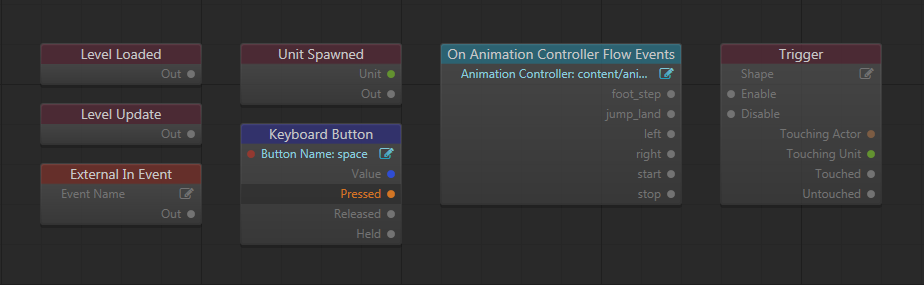
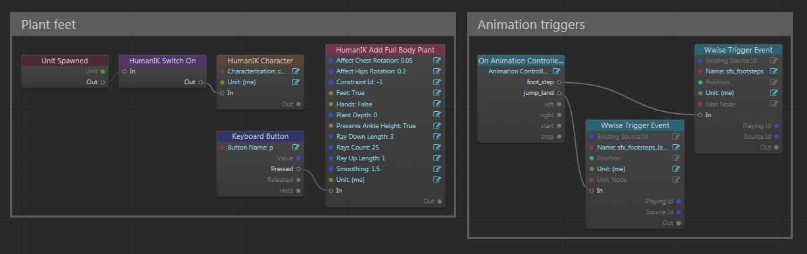
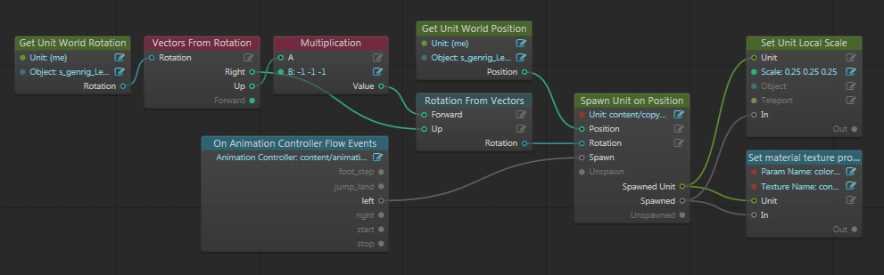

# About Flow Evaluation

Nodes in your Flow graphs do not always get evaluated. Graph evaluation follows a deterministic chain of events from node to node, but setting up that chain so that the right events happen in the right order in response to the right things can sometimes be tricky.

This topic describes the basic rules to keep in mind when wiring your Flow graphs.

## Rule 1: Evaluation starts with an event emitter

Certain kinds of Flow nodes emit events in response to triggers that happen in the engine or elsewhere in your gameplay logic. You can recognize these nodes because they fire an output event, even though they typically have no input events.

For example, some commonly used event emitter nodes include:

-	**Event > Level Loaded**, **Event > Level Update**, and **Event > Level Shutdown**, which you can use in the **Level Flow** Editor.
-	**Event > Unit Spawned** and **Event > Unit Unspawned** in the **Unit Editor** Editor.
-	**Event > Trigger** and **Event > Physics Collision**, which respond to physics events.
-	**External > External In Event**, which handles an event that was triggered by another Flow node or from a Lua script.
-	**Animation > On Animation Controller Flow Events**, which you can use to respond to Flow events that are set up in a unit's animation clips.
-	Input events from the user's keyboard or controller.

Note that the **Event > Trigger** node does have an input event that turns it on or off. While enabled, it is capable of emitting new events that kick off new graph evaluations; while disabled, it emits no events.

## Rule 2: Evaluation continues along the chain of events

When a node receives an input event, that event triggers the evaluation of the node. If that node produces one or more output events that are connected to the input slots of other nodes, evaluation then propagates along those connections to the next nodes.

Once a node is evaluated that contains no connected output events, that part of the chain is done.
Nodes that do not have an input event slot connected to another node's output event slot will not be evaluated.

Note that a Flow graph often has multiple separate chains that get evaluated at different times, in response to different triggers. Each chain is independent of the others.

For example, in this unit flow there are three separate event chains that are evaluated at different times. When the unit is spawned, the HumanIK system is initialized and activated. Pressing a specific button activates HumanIK foot planting. Finally, in the group on the right, each time the character's animation controller detects a footstep or jump marker in the animations it triggers Wwise to play a sound.

### Exception: query nodes

Some nodes, called *query nodes*, break Rule 2. These nodes produce output data values that other nodes can query for use in their calculations. Query nodes are evaluated only when another downstream node that uses one or more of the query node's output values is evaluated.

You can think of query nodes as reversing the typical direction of evaluation. Instead of a query node being triggered by an upstream node emitting an event, it is triggered by a downstream node that wants to use one of its outputs. When multiple query nodes are chained together, evaluation reaches back to the first one in the chain and passes the values forward again.

You can recognize query nodes because they have only data connectors, with no input or output events at all. Typically, they are used to retrieve up-to-date data from variables or units, to come up with values for math or Boolean operations, or to convert input data values between different types.

Here is an example of a unit flow graph that uses both event connections and query nodes. The initial trigger is an animation controller event that indicates when the left foot hits the ground. That causes a new unit to spawn, to represent a footprint. In its calculations, the **Unit > Spawn Unit on Position** node needs to know the position and orientation for the new unit, so it reaches back through a chain of query nodes to get those values.

