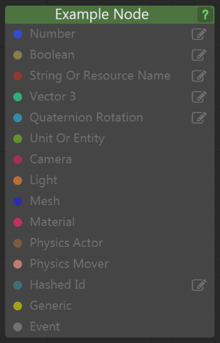

# Flow Node Colors and Types (Level Flow)

Each Flow node can take in certain types of input data, and can produce other kinds of output data. Each of the node's input and output connections uses a color to tell you the type of data it handles.

These colors are always the same across all nodes. Once you get used to the color conventions, it's a quick visual cue that can help you make connections faster without having to look up the nodes in the [Flow node reference](../../../flow_ref/index.html).

 Blue: Numbers.

>	Numbers can be integers or decimals, positive or negative.
>
>	Look under the **Math > Numeric** category for nodes that can help you work with these numbers.

 Light Brown: Booleans

>	Booleans can be true or false.
>
>	Look under the **Math > Boolean** category for nodes that can help you work with these values.
>
>	A common use for Boolean values is to do something different depending on the value -- see the **Flow Control > Branch** for one way you can choose between two alternative Flow graphs depending on whether an input value is true or false.

 Dark red: Strings

>	Strings are words or phrases of text.
>
>	Sometimes you are free to enter any text you want for a string. Other times, you may be constrained to certain pre-set values. For example, if a node requires the name of a certain type of resource in your project, you'll be asked to select one of those resources from your project when you click the  icon.

 Teal: Vector3 data.

>	These usually represent positions or directions in 3D space.
>
>	Look under the **Math > Vector** category for nodes that can help you work with vector data.

 Light blue: Quaternion rotations

>	These values represent rotations in 3D space. Internally, they are expressed as [quaternions](https://en.wikipedia.org/wiki/Quaternion).
>
>	Look under the **Math > Rotation** category for nodes that can help you work with quaternion rotations.

 Green: Units and entities

>	Each green connection represents an individual unit or entity that has been spawned in a level.
>
>	In Level Flow, use the **Data > Level Unit** and **Data > Level Entity** nodes to select a unit or entity that you've placed in the level. In Unit Flow, or when setting up a Flow component for an entity, use the special **Me** value to refer to the unit or entity that is using your Flow graph.

 Maroon: Cameras

>	These connections represent a camera that is owned by a unit.
>
>	The **Camera > Get Active Camera** and **Camera > Set Active Camera** nodes are very handy for working with the camera that is currently being used to render in the main window, but be aware that these nodes only work if your project is using the Appkit. (If you started from a template project and didn't change your boot script, then you're probably using the Appkit).
>
>	You can also use **Unit > Get Unit Camera** to get a camera owned by a particular unit.

 Orange: Lights

>	These connections represent a light that is owned by a unit.
>
>	Look in the **Lights** category for nodes that you can use to read and modify a light's properties. You can also use **Unit > Get Unit Light** to get a light owned by a particular unit.

 Dark blue: Meshes

>	These connections represent a mesh that is owned by a unit.
>
>	You can use **Unit > Get Unit Mesh** to get a mesh owned by a particular unit. At the moment, meshes are mostly useful in order to retrieve the materials that are assigned to its material slots. Use the **Material > Get Mesh Slot Material** and **Material > Get Mesh Slot Material** nodes to do that.

 Magenta: Materials

>	A material connection represents a single instance of a material, which is usually associated with a specific mesh owned by a unit.
>
>	You can get a material from a mesh, using the **Material > Get Mesh Slot Material** and **Material > Get Mesh Slot Material** nodes. Once you have this material, you can use the other nodes in the **Material** category to set new values for input variables exposed by that material.

 Dark brown: Physics actors

 Salmon: Physics movers

>	Actors and movers are representations of a solid object inside the physics simulation.
>
>	Usually, you'll retrieve an actor or a mover using the **Unit > Get Unit Actor** or **Unit > Get Unit Mover** nodes. Once you retrieve the object, you can pass it in as an input to the nodes in the **Physics** category to set and retrieve the properties of the object.

 Slate blue: IDs

>	IDs are hashed representations of strings, which the engine uses internally to keep track of names. For most purposes, you probably won't need to use this data type.

 Yellow: Generic data

>	A few nodes have *generic* input connections, which can accept any type of object listed above.
>
>	For example, the nodes in the **Script** category use generic inputs to accept objects that the node passes on to the Lua function that it runs.

 Grey: Events

>	Events control the way the Flow graph is evaluated.
>
>	A node is triggered when an event gets passed into one of its *input* event slots. The node performs some action in response to that event, and may pass on an event through one or more of its *output* event slots. This in turn triggers any other nodes that have their input event slots connected to those output events. For a thorough discussion, see also ~{ About Flow Evaluation }~.
