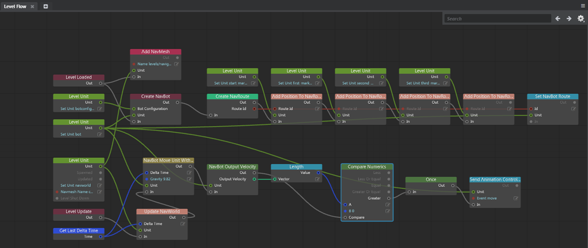

# Level Flow Editor

- **Window > Level Flow**

A visual authoring tool that handles all of the level logic you want to happen when loading your level, or when the engine is running. Use the **Level Flow** Editor for tasks like spawning units, applying level effects, or triggering events.

For detailed reference to the Flow nodes offered by {{ProductName}}, see [here](../../../flow_ref/index.html).

##Flow Editor Hotkeys

|  Basics |
|----------------------------|-----------------|
| Create node | Right-click or Tab |
| Delete node | Delete            |
| Cut |      Ctrl + X        |
| Copy |      Ctrl + C        |
| Paste |         Ctrl + V     |
| Duplicate |       Ctrl + D       |
| Group|      Ctrl + G        |
| Ungroup |       Ctrl + Shift + G       |
| Move nodes |       Drag node header       |
| Undo |    Ctrl + Z      |
| Redo |    Ctrl + Y      |

|  Navigation    |
|----------------------------|-----------------|
| Pan | Alt + middle-drag |
| Zoom | Alt + right-drag             |
| Frame All | F             |
| Frame Selection | F         |

| Selection |
|----------------------------|-----------------|
| Toggle selection | Ctrl + click |
| Add Selection | Ctrl + click or Shift + click            |

| Connection |
|----------------------------|-----------------|
| Connect multiple | Shift-click pin |
| Maintain connection | Ctrl-click pin             |
| Reconnect node | Ctrl-click pin             |
| Disconnect node | Alt-click pin             |

---
Related topics:
-	~{ Working in the Level Flow Editor }~
-	~{ Visual programming using Flow }~
-	~{ Create a trigger }~
---
