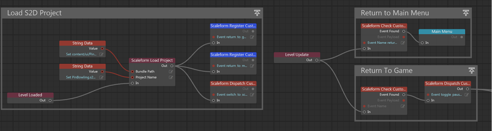

# Испоьзуем Flow для управления UI

Помимо использования скриптов для управления взаимодействием между Scaleform Studio и {{ProductName}}, мы предоставляем базовый набор узлов Flow для облегчения взаимодействия между двумя системами.

<dl>

<dt>Scaleform Load Project</dt>

<dd>Этот узел загружает проект Scaleform Studio.  Этот узел нужно вызвать прежде чем использовать любой другой Scaleform Flow узел.

Аргумент ProjectName это имя проекта с разрешением .s2dproj , например: MyProject.s2dproj.

Аргумент BundlePath это относительный путь к root проекта {{ProductName}}, например: content/ui/MyProjectFolder</dd>

<dt>Scaleform Load Project and Scene</dt>

<dd>Этот узел загружает проект Scaleform Studio. Этот узел нужно вызвать прежде чем использовать любой другой Scaleform Flow узел. Если scene предоставлена то она будет установлена в качестве стартовой.

Аргумент Project позволяет вам выбрать resource id в Scaleform Studio project для загрузки.

Аргумент Scene позволяет выбрать resource id сцены Scaleform Studio ассоциированной с проектом.
Этот узел возвращает boolean значение для индикации был ли проект успешно загружен.
</dd>

<dt>Scaleform Unload Project</dt>

<dd>Этот узел очищает текущий проект.  Вызывается перед переключением проектов или перед завершением работы.</dd>

<dt>Scaleform Dispatch Custom Event</dt>

<dd>Этот узел отсылает кастомное событие в загруженный сейчас проект Scaleform Studio. Любой пользовательский прослушиватель событий будет уведомлен и может проверить, не является ли пользовательское событие чем-то, на что они должны ответить.

Аргумент Event это строка которая содержит имя события и разделенные двоеточием аргументы, например: `MyEvent:40:AString:true` отправит событие с именем MyEvent с аргументами `40`, `AString` и `true`. В соответствующем обработчике события, строка name будет обработана для извлечения данных. </dd>

<dt>Scaleform Register Custom Event Listener</dt>

<dd> этот узел регистрирует слушателя для кастомных событий в interactive engine. Любое кастомное событие которое не было зарегистрировано будет проигнорировано.

Аргумент Event должно быть именем кастомного события независимо от любых данных, например: для имени строки MyEvent:40:true имя события для регистрации должно быть MyEvent.</dd>

<dt>Scaleform Unregister Custom Event Listener</dt>

<dd>Этот узел заставляет зарегистрированного слушателя прекратить прослушивание кастомного события.

Аргумент Event должно быть именем кастомного события независимо от любых данных, например: MyEvent.</dd>

<dt>Scaleform Unregister All Event Listeners</dt>

<dd>This node unregisters all registered events.</dd>

<dt>Scaleform Check Custom Event Listeners</dt>

<dd>This node checks to see if a custom event that has been registered has occurred at some prior time. If the event has occurred, the event data payload will be returned and the event cleared from the event list to prevent double eventing.

The EventName argument is the name of the event to check for, for example: MyEvent

The EventPayload return will be name of the dispatched event.  For Flow, we recommend at this time using colon delimited data strings, for example: MyEvent:40:AString:true.

The EventFound will trigger if the event is found, thus continuing the flow processing chain.</dd>

<dt>Timeline</dt>

<dd>Timeline events all take a full path to a given actor, for example: Scene0.Actor1.Actor2.Actor3 and performs the requested action if the specified actor has a timeline associated with it. Use the Copy Clipboard icon next to actor name in the Scaleform Studio Editor to get the path.

<dl><dt>Scaleform Goto Frame and Play</dt>

<dd>Goes to a specified frame on the timeline and begins the animation at that point.</dd>

<dt>Scaleform Goto Frame and Stop</dt>

<dd>Goes to a specified frame on the timeline and stops the animation at that point.</dd>

<dt>Scaleform Goto Label and Play</dt>

<dd>Goes to a specific label on the timeline and begins the animation at that point.</dd>

<dt>Scaleform Goto Label and Stop</dt>

<dd>Goes to a specified label on the timeline and stops the animation at that point.</dd>

<dt>Scaleform Play</dt>

<dd>Begins playing the animation from the current timeline position.</dd>

<dt>Scaleform Stop</dt>

<dd>Stops playing the animation at the current timeline position.</dd></dl></dd>

</dl>

