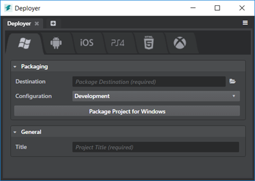

# Using the Deployer panel

- **Window > Deploy and Connect > Deployer**

You can use the **Deployer** panel to create final, standalone packages of your game on each of your target platforms. It has a separate tab dedicated to each target that Stingray supports.

Basic usage is the same across all target platforms:

1.	Ensure that you have set up any prerequisites required for your target platform. See the page for your target platform under ~{ Supported platforms }~.

2.	You provide the settings requested by the **Deployer** panel.

3.	Click the **Package Project for...** button to launch the deploying process. The **Deployer** creates the final game package in the location that you specify.

When the **Deployer** finishes, you may also need to use tools specific to the target platform in order to distribute the packaged game or install it on the target platform. For example, for Windows platforms you may need to create an installer; for iOS or Android platforms you need to use tools provided by Apple or Google to get your app uploaded to the online store for customers to purchase it; for PlayStation 4 platforms you need to use tools provided by Sony to complete the process.

For details on all the platform-specific settings required by the **Deployer** panel, see the other topics in this section:

-	~{ Package the project for Windows }~
-	~{ Get started on Android }~
-	~{ Get started on iOS }~
-	~{ Get started on PlayStation 4 }~
-	~{ Get started on Xbox One }~
-	~{ Get started for the Web }~

## Common settings

There are some common fields that are shared across all tabs:

<dl>
<dt>Destination</dt>
<dd>Specifies where to install the final package once it's produced. Within this destination folder, Stingray creates a sub-folder with the platform name. Within the platform folder, it creates another sub-folder with the configuration name. This means that all of your tabs can use the same destination folder setting without overwriting each others' output.</dd>

<dt>Configuration</dt>
<dd>Determines which configuration of the Stingray engine will be used to package your project. By default, this is set to Release. It is generally recommended that you keep this default setting when deploying a standalone build, unless you have a specific need to use a different configuration. For more information, see ~{ About engine configurations }~.</dd>
</dl>
