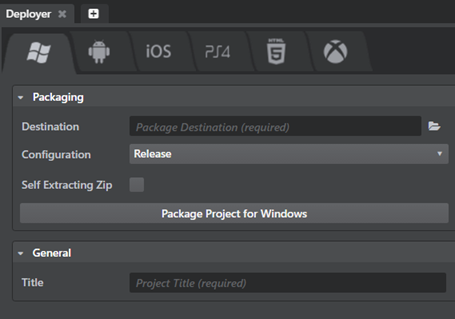

# Package the project for Windows

To package a project for Windows:

1.	In the interactive editor, open the **Deployer** panel to the Windows tab and enter the required information. (See below.)
2.	Click **Package Project for Windows**.

The deployer creates an executable file for your app, named according to the title you set in the **Title** field. It creates a self-extracting zip file containing this *.exe* file, along with all required *.dll* files and bundled data, and saves to the location on your computer that you specify in the **Destination** field.

If **Self Extracting Zip** is unchecked, you can test or distribute your app by simply copying or zipping up the folder with the *.exe* file and the bundled data, or by packaging the folder contents into an installer.

## Additional runtime requirements

To run on Windows, the interactive engine requires:

-	The **DirectX End-User Runtimes (June 2010)** from Microsoft, available at <https://www.microsoft.com/en-us/download/details.aspx?id=8109>.

-	The **Visual C++ Redistributable for Visual Studio 2015** from Microsoft, available at <https://www.microsoft.com/en-ca/download/details.aspx?id=48145>.

Recent systems are likely to have these runtime requirements installed already. However, if you distribute your deployed project to a customer that does not already have these requirements installed, your customer will need to install them in order to successfully run your project.

If you create an installer for your project, you should package these redistributable libraries into your installer.

## Windows deployment settings

You can set the following options in the **Deployer** panel for Windows devices.

### Packaging settings

The **Destination** and **Configuration** settings are common for all tabs. See ~{ Using the Deployer panel }~.

<dl>
<dt>Self Extracting Zip</dt>
<dd>When checked, the deployer packages the project as a self-extracting installer file.</dd>
</dl>

### General settings
<dl>
<dt>Title</dt>
<dd>The title of your project. This sets the name of the executable file for the application.</dd>
</dl>
