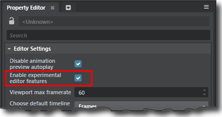

# About Experimental Features

From time to time, we work on features that get we can't wait to share them with you even though they're still in development. This gives us a chance to collect your feedback about how they work for you in real life, before they get integrated as an official part of Stingray.

If you're interested in trying out experimental features, we would hugely appreciate hearing your opinions about them! Please drop us a line about your experiences on our main discussion forum, at:

>	<http://www.autodesk.com/stingray-forums>

Note that, while you're free to use these experimental features as you see fit, we generally don't recommend them for real production use. Before you use experimental features on anything precious, it's a good idea to back up your project data just in case.

A few reasons why we might tag something as experimental:

-	It might rely on third-party technology that is still in development.
-	It might not be stable and thoroughly tested up to our usual standards, or it might cause unexpected interactions with other plugins and components.
-	We might want to validate a new idea or direction with customers.
-	We might expect to make significant changes to the feature in the near future, so we're not ready for it to be widely adopted in real productions yet.

## Enable or disable experimental features

Experimental features are hidden by default. If you want to try them out, enable them in your Stingray editor settings.

1.	From the **File** menu, select **Settings > Editor Settings**.

2.	In the ~{ Property Editor }~, turn on **Enable experimental editor features**.

