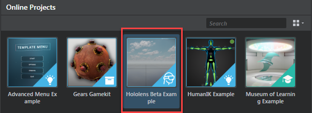
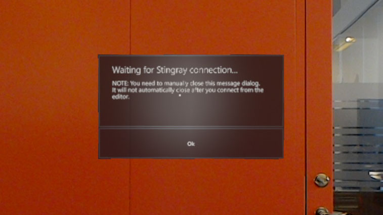

# Get started on HoloLens

>**Note: The HoloLens platform is still in development and work on the deployment and editor workflows is ongoing. This page is subject to change.**

## Step 1. Building for HoloLens

Building for UWP requires Visual Studio 2015 with the prerequisites listed on the ~{ Supported Platforms }~ page.

>**Tip:** You can build the uwp32 engine for HoloLens with the console command `ruby make.rb -p hololens`.

## Step 2. Deploying to HoloLens

When working on HoloLens you can do one of the following:

- Add your project data to Visual Studio and deploy it to the device together with the engine executable.
- Deploy the executable without data and then connect the editor to the device. This is similar to the workflow that's available for iOS. See ~{ Get started on iOS }~.

A WIP project for HoloLens testing purposes can be found in the **Online Projects** tab in the **Project Manager**.

>**Note:** This project is available only for source code customers.

### Bundle project data ###

>**Important:** You must enable experimental editor features (**File > Settings > Editor > Settings** and turn on **Enable experimental editor features** in the **Property Editor**) before you can compile data for UWP/HoloLens in the editor. For more information, see ~{ About Experimental Features }~.

To compile and bundle the data:

1. Open the HoloLens project in the editor.
2. In the **Connections** panel, right-click a UWP platform target and select **Compile and Bundle data...** to bundle the game data for the HoloLens.
The data is output to the `hololens_project_data/uwp_bundled` folder next to the project on disk.

### Add project data to a package ###

If you want to create an app package with data you need to add the compiled and bundled data to Visual Studio:

1. Create a folder called `assets` in the source repo root dir. (The same folder that make.rb is in.)
2. Copy the bundled data into this folder.
3. Re-run make.rb.

  >**Tip:** You can run it with `--no-build` to only generate the solution files.

Alternatively you can add the files to Visual Studio manually:

1. Open the uwp32 Visual Studio solution (`build/engine/uwp32/{{SR_DOC_EXE_PREFIX}}_engine_uwp32.sln`)
2. Add the bundled game data to the "main_uwp" Visual Studio project, and set each item as "Content" by selecting all of them, right-clicking and going into Properties.

### Deploying through Visual Studio ###

There are multiple ways you can deploy through Visual Studio:

* If you have the HoloLens Emulator, select "HoloLens Emulator" as Target and run the project.
* If you have the HoloLens connected by USB, select "Device" as Target and run the project.
* To deploy over the network, you can select "Remote Machine" as Target and set the HoloLens IP as the Machine Name on the project debug properties page.

It may take a few minutes for the project to start appropriately on the device.

>**Note:** When deploying to a HoloLens headset, the data already on the device is not always cleaned up properly. It´s a good idea to enable "Remove Non-Layout Files from Device" on the project debug properties page in Visual Studio if you have any issues.

### Deploying through Device Portal ###

You can create a complete appx package in Visual Studio that you can install through the Device Portal. This allows you to share an app package with someone who doesn't have access to Visual Studio.

If you want to create a package with data you need to first follow the steps in the _Add project data to package_ section listed above.

1. Create an app package with the "Create App Packages" wizard in Visual Studio. You can follow the instructions under the _Create an app package_ title on this page: [Packaging UWP apps](https://docs.microsoft.com/en-us/windows/uwp/packaging/packaging-uwp-apps)

    Select "No" when asked if you want to build a package for uploading to the Windows Store. Skip the validation step at the end of the wizard.

2.  When the Package is generated you can install it through the HoloLens Device Portal. See this page for information on how to use the Device Portal: [Using the Windows Device Portal](https://developer.microsoft.com/en-us/windows/holographic/using_the_windows_device_portal)

## Step 3. Connect the editor to the device

For more background information, see ~{ Connect to a remote device }~.

**To connect to an HoloLens device:**

1.	Deploy the engine to the device without project data using the steps detailed above.

2.	Start the engine on the device.

	When the app starts up, it shows the following information while it waits for an incoming connection from the interactive editor:

	

3.	In the interactive editor, use the **Connections** panel (**Window > Deploy and Connect > Connections**) to set up the connection to the IP address for the device, then run the project.

	For details, see ~{ Using the Connections panel }~.

    >	**Note:** The engine app on the device must be in this waiting state in order for the editor to initiate a connection. Each time you want to run your project or mirror your viewport, you have to close and restart the engine on the device.

4. Close the message dialog window on the device manually when connecting to the editor. The window does not close automatically, and while it is visible it hides the 3D content rendered by the engine.

### Developer Tips

The engine's console output is available on the _Logging_ page in the Device Portal under the `Microsoft-Windows-Diagnostics-LoggingChannel` provider.

Useful information for debugging is available from various different providers. We have found useful information in the `Microsoft-Windows-WindowsErrorReporting`, `-ProcessStateManager` and `-ProcessExitMonitor` providers.
