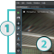

# Начало работы

Как только вы скачали и установили {{ProductName}}, вы можете выбрать **Autodesk > {{ProductName}}** из окна **Start** меню для запуска.

Что теперь? Что ж, вы можете посмотреть больше статей в этом разделе о начале работы например: ~{ Interface overview }~, скачать видео [video tutorials](../tutorial_link/tutorials_on_area.html), или перейти прямо в.

ЗАпустите {{ProductName}} *editor*. Это основной инструмент который вы будете использовать для создания вашего контента. Редактор помогает делать следующее:

-	вносить 3D контент типа моделей, анимаций и текстур из других приложений типа Maya или 3ds Max,
-	располагать свой контент по сценам, которые называют *levels*,
-	настроить способ взаимодействия конечных пользователей с вашими сценами и контентом,
-	создавать другие виды контента, специфичные для {{ProductName}}, такие как эффекты частиц,
-	и *разворачивать* ваш контент в автономном пакете или приложении для одной или нескольких целевых платформ, таких как Windows, iOS, или Android.

<table class="not-ruled"><tr><td>

</td><td>
**Tip:** Check out the ~{ Interface Overview }~ for a quick intro to the main parts of the editor!
</td></tr>
</table>

Но первое, что вам нужно сделать, это создать и открыть *project*. Проект содержит все различные типы файлов и активов, которые вы будете использовать для создания своего интерактивного приложения. -- 3D модели, маткриалы итекстуры, уровни, Lua файлы, и т.д. {{ProductName}} поставляется с некоторыми стандартными проектами шаблонов, которые вы можете использовать в качестве отправной точки, или вы можете загрузить образец проекта из вкладки **Online Examples** в ~{ Project Manager }~.

See the pages under ~{ Set up a project }~ for more on what projects are and how to work with them.

Ваш проект откроется в интерактивном редакторе, но это не так, как люди в конечном итоге испытают ваш проект, когда вы его распространяете. Итак, одна из первых вещей, которые вы хотите сделать с вашим новым проектом, - это проверить, как это работает в интерактивном движке runtime. Не пропустите ~{ Test and build a project }~ для ознакомления с запуском вашего контента.
