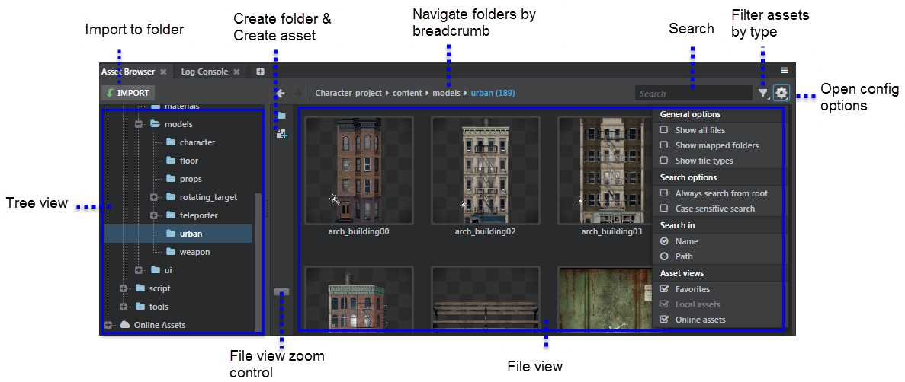
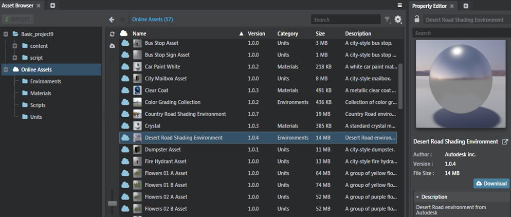
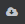
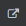

# Asset Browser

- **Window > Asset Browser**

The **Asset Browser** is the main way to browse and import assets in your project. It includes two main view panels, the folder or tree view, and the file view. Both areas include several controls that let you browse or search for assets efficiently.

| To: | |
| ------------- | ------------- |
| Import content | Navigate to the folder where you want to import files, then click Import, or, right-click in the File view area to select **Import Asset**.  |
| Create a new resource or folder | Navigate to the folder that you want to contain your new folder or asset. Right-click on the folder and select one of the **Create** options from the contextual menu, or click one of the **Create** icons shown between the tree view and the file view. |
| Narrow asset types displayed in File view area  | Click the Filter icon  and enable only the types you want. |
| Edit an original source scene in your DCC tool | Right-click an asset and select **Open Source Asset**.  |
| Refresh current window  | F5  |
| Focus Search field | Ctrl + F |
| Return to the last opened folder  | Backspace  |
| View history of assets navigated to | Alt + left arrow or right arrow to navigate back and forth. |
| Open selected asset in Windows Explorer  | Right-click the asset and select **Show in Explorer**.  |
| Open a folder location in Windows Explorer  | Right-click anywhere in the **File View** and select **Show in Explorer**.  |
| Update assets in a scene  | Right-click the assets and select **Re-import** option to import them again using the **Import FBX** options window. Note that the Re-import option displays only for units, animation clips and skeletons.|
| Duplicate assets and folders | Right-click assets and select **Duplicate**. For folders in the Asset Browser, right-click and select **Duplicate Folder**. |

## Tree view
The Tree view displays all folders in your project. Select a folder to display its contents in the File view area.

You can use the **Import** button directly above the Tree view to import assets directly to a selected folder.

## File view

The File view displays all assets and sub-folders in a selected folder.

When you select an asset in the file view area, a preview displays in the ~{ Asset Preview }~ window.

### File view zoom level

Use the vertical slider between the tree view and file view to control how large or small the file icons in the file view display. At maximum zoom, the files display in a list. At minimum zoom, the file icons display full thumbnails, which are generated when the asset is imported or updated.

>**Tip:** Press Ctrl + mouse wheel over the file view to change the zoom level.

### Read-only files

The file view indicates read-only folders and resources using a lock icon: .

## Favorites

The **Favorites** lists the assets and folders you bookmark as a favorite . To add a frequently used asset or folder as a favorite, check the favorite icon  beside the asset/folder or right-click and select **Add to Favorites**. You can also drag and drop assets and folders to the **Favorites**.

To remove the favorite bookmark, select the asset or folder, and uncheck the Favorites icon or right-click and select **Remove from Favorites**. You can also hide the **Favorites** from the Asset view by unchecking *Favorites* in the configuration option .

## Searching

Use the Search field above the file view to search for resource names within the currently selected folder and its sub-folders.

>**Tip:** Press Ctrl + F to focus the Search field.

Click the config icon  to set search options.

-	Enable **Always search from root** if you want the search to find resources anywhere in your project, instead of under the current folder.
-	Enable **Case sensitive search** to make your search only return results that match the case of the search query.
-	Use the **Name** option to match only in the last part of a resource name, or the **Path** option to match in the full path and name of each resource.

## Filtering

You can set the file view to show only selected resource types. Click the Filter icon  to open a list of resource types. Toggle each filter on and off to further narrow your search results to a specific asset type. (For example, turn off Flow nodes if you are primarily working with geometry or animation clips.)

You can also use the configuration options  to control what resources are shown in the tree view and the file view:

-	**Show all files** makes the file view show all files on disk, even those that are not project resource types. This exposes files like thumbnails, editor settings files, and operating system files.
-	**Show mapped folders** makes the tree view and search include the core resources. See also ~{ Working with core resources }~.
-	**Show file types** does not filter the view, but makes each resource show its file extension (i.e. its resource type).

## Duplicating assets

When working with assets, you often need to replicate assets like materials and animation clips to try out different variations. To do so, right-click the asset in the **Asset Browser**, select **Duplicate** and assign a name for the asset. This creates a duplicate asset which you can edit independently of the original asset. You can also duplicate folders in the Tree view making it easy to organize and customize your assets.

>**Tip:** Press Ctrl + D to duplicate selected assets.

## Accessing online assets

Use the **Online Assets** in the Tree view to browse, search and find online assets.

- To download an online asset, do any of the following:

    - Right-click an asset and select **Download Asset**, or click the **Download and install asset** icon .
    - Select an asset and click the **Download** button in the **Property Editor**.

- To cancel downloading of the asset, click the yellow icon .

- To search for an online asset, use the Search field. The number of matching assets are listed next to the **Online Assets**.

- To hide **Online Assets** from the Asset view, uncheck *Online Assets* in the configuration option .

- To view or locate a downloaded asset in your project, select an installed asset (indicated with a green checkmark) and either click  or right-click and select **Locate in Project**.

The online assets are not listed in the Asset Browser if the Online Assets server is disconnected from the cloud services.

---
Related topics:
- ~{ Interop with Maya, Maya LT, or 3ds Max }~
- ~{ Importing Assets }~
---
