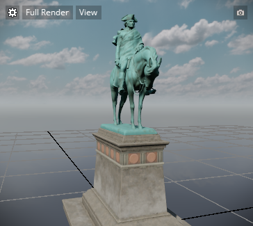
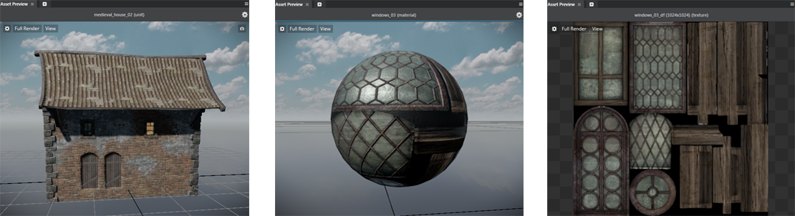
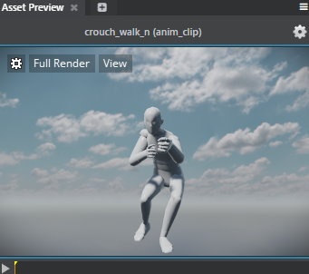
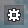

#Asset Preview

- **Window > Asset Preview**

Displays assets as you browse and select them in the **Asset Browser**. You can zoom, pan, and tumble in the **Asset Preview** just like you do in the **Level Viewport**.

- When you select a material, the **Asset Preview** displays the shaderball with your material applied, letting you preview the material within the current lighting environment. You can also preview 2D texture files.

	

- When you select an animation clip, the animation automatically plays back in the **Asset Preview**. To disable automatic playback, select **File > Settings > Editor Settings**, then enable **Disable animation preview autoplay** in the **Property Editor**.

	

> **Note:** Adjusting the Shading Environment settings (see ~{ The Shading environment and post effects }~) does not update the rendering in the **Asset Preview**  window.

## Preview levels

By default, the Asset Preview shows your selected asset in a different level from the level you are currently working on in the editor. It uses the same default level that the editor uses when you create a new level, taken from the core resources that come with {{ProductName}}.

You can change the background of the Asset Preview, if you want to see your assets rendered with different scenery, different lighting, and a different shading environment.

To change the preview level:

1.    Click the gear icon  overlay in the Asset Preview viewport.

1.    From the contextual menu, choose **Background Level > Select**.

1.    Choose the level you want to use from the list provided, and click **OK**.
