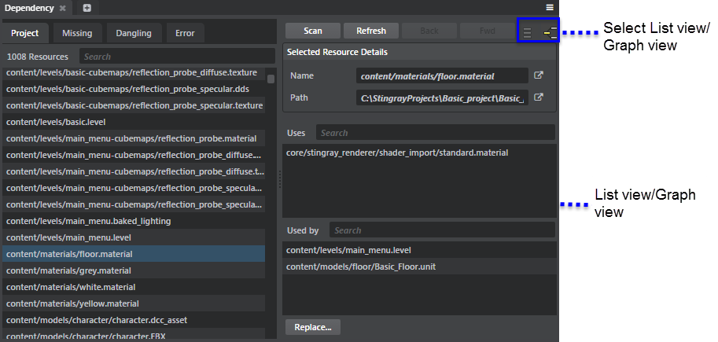

# Dependency tool

- **Window > Dependency**

Use the **Dependency** tool to find which assets are used in a level, which are not used, to check file dependencies, and to easily replace files.

When you select an asset, the **Dependency** tool shows you:

-  The assets that your selection refers to, in the **Uses** list.
-  The assets that refer to your selection, in the **Used by** list.  

| To: | |
|------|----|
| View all assets in the project | Click the **Projects** tab. |
| View assets that are used but cannot be found in the project | Click the **Missing** tab. |
| View existing assets that are not used in the project | Click the **Dangling** tab. |
| Replace an asset | Select an asset, click **Replace**, and then select an asset from the dialog window that pops up. Click **Ok** to replace the selected asset. |
