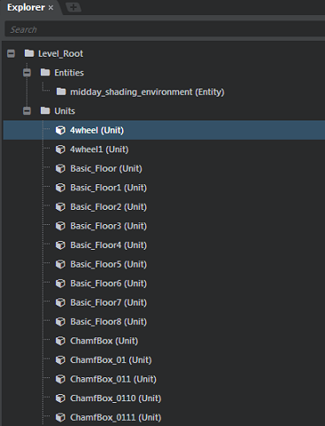
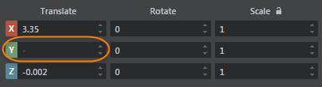
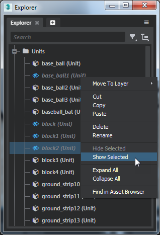
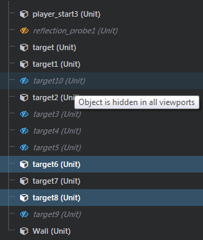

# Explorer panel

*	**Window > Explorer**

The **Explorer** panel displays a hierarchical representation of all objects in the level.  When you select a unit in the **Explorer** panel, it's also selected in the **Level Viewport**, and its properties display in the **Property Editor**. This is an easy way to select things you want to edit in the **Property Editor**.

You can select multiple objects in the **Explorer** panel to view and edit multiple shared attributes at the same time in the **Property Editor**.

If the selected objects already share the same value for a property, the value displays in the **Property Editor** as usual. If their values differ, a dash displays.

To toggle the visibility of objects, right-click a unit in the **Explorer** panel, then select **Hide Selected** or **Show Selected** from the menu that appears.

For objects that are hidden in all **Level Viewport** views (globally hidden), the **Explorer** panel displays a blue visibility icon. If objects are hidden in individual views (locally), you'll see orange visibility icons. Hover over objects to view a tooltip that explains their visibility settings.

