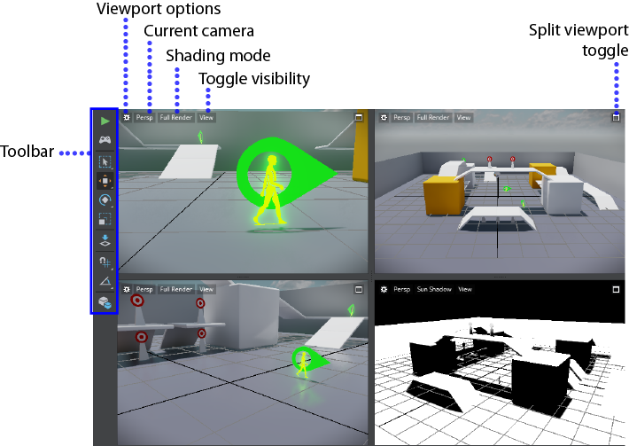
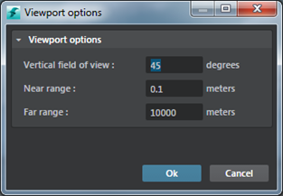

# Level Viewport

- **Window > Level Viewport**

The main editor where you'll place objects and build interactive worlds.

 

| To: |  |
| ------------- | ------------- |
| **Split the viewport into four panes: ** | Click the split viewport toggle at the top right.  Click the toggle again to switch back to a single panel viewport. |
| **Show or hide the grid or gizmos per view panel:**  | Click the **View** HUD, then enable or disable the **Gizmos** and **Grid** options.   |
| **Change shading modes: ** | Click the default **Full Render** mode HUD, then select from the other modes in the menu that appears.  |
| **Set vertical field of view, near and far range:**  | Click to open the **Viewport Options**.   |
| **View performance statistics**| Click **View > Performance Hud** option and then select from one of the performance categories. |

> **Note:** The **Level Viewport** **View** menu gives you show and hide options for each viewport panel individually. To globally show or hide gizmos or the grid in all viewports, use the show/hide controls in the **Edit** menu.

 

> **Note:** Showing or hiding individual objects in the level (using **Edit > Object Visibility** options) affects only what you can see while you're working in the editor, it won't actually affect the visibility of objects in your interactive app.

##Viewport Options

---
Related topics:
-	~{ Toolbar }~
-	~{ Navigate in the Level Viewport }~
-	~{ Place objects in a level }~
-	~{ Move, rotate, or scale objects in a level }~
---
