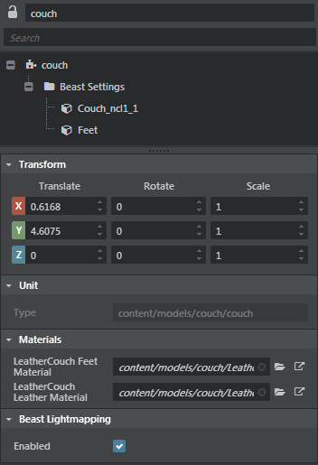

# Property Editor

This panel is the main location where you can edit the properties of objects selected in the **Asset Browser** or **Explorer**.

You can select multiple objects in the **Explorer** panel to view and edit multiple shared attributes at the same time in the **Property Editor**.

If the selected objects already share the same value for a property, the value displays in the **Property Editor** as usual. If their values differ, a dash displays.

---
Related topics:
- ~{ Explorer panel }~
- ~{ Animation clip properties }~
-	~{ Marker properties }~
-	~{ Edit project settings }~
-	~{ Particle system properties }~
-	~{ Prototype properties }~
-	~{ Terrain properties }~
-	~{ Trigger properties }~
-	~{ Volume properties }~
-	~{ Standard material properties }~

---
